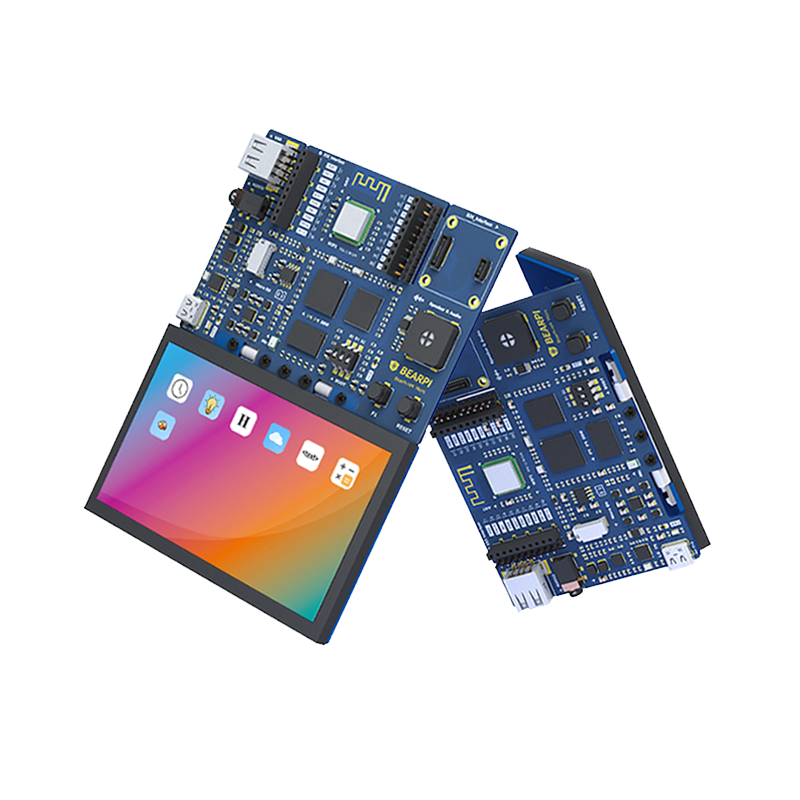

---
# 小熊派(BearPi-HM Micro)

## 一、BearPi-HM Micro 开发板介绍

BearPi-HM Micro开发板是一块高度集成并可运行OpenHarmony系统的开发板，板载高性能的工业级处理器STM32MP157芯片，搭配4.3寸LCD电容式触摸屏，并板载wifi电路及标准的E53接口，标准的E53接口可扩展智能加湿器、智能台灯、智能安防、智能烟感等案例。可折叠式屏幕设计大大提高用户开发体验，便于携带和存放，更好地满足不同用户的需求，拓展无限可能。

## 二、设备开发手把手教程系列

1、视频系列（B站） 对应PPT地址
* [P1. 初识BearPi-HM Micro开发板](https://www.bilibili.com/video/BV12Y411H7ry?p=1)
* [P2. 开发环境搭建(复杂)——编译环境搭建](https://www.bilibili.com/video/BV12Y411H7ry?p=3)
* [P3. 开发环境搭建(复杂)——源码获取及编译](https://www.bilibili.com/video/BV12Y411H7ry?p=4)
* [P4. BearPi-HM Micro开发板源码烧录](https://www.bilibili.com/video/BV12Y411H7ry?p=5)
* [P5. OpenHarmony 快速入门：HelloWorld](https://www.bilibili.com/video/BV12Y411H7ry?p=6)
* [P6. OpenHarmony 快速入门：点亮LED](https://www.bilibili.com/video/BV12Y411H7ry?p=7)
* [P7. OpenHarmony 快速入门：安装HAP](https://www.bilibili.com/video/BV12Y411H7ry?p=8)
* [P8. OpenHarmony 快速入门：JS点亮LED](https://www.bilibili.com/video/BV12Y411H7ry?p=9)

2、文档系列（Gitee）
- [1. 初识BearPi-HM Micro开发板](device-dev/BearPi-HM_Micro开发板介绍.md)
- [2. 开发环境搭建](device-dev/BearPi-HM_Micro开发环境搭建.md)
- [3. 源码获取、编译烧录](device-dev/BearPi-HM_Micro开发板编译调试.md)
- [4. 编写一个hello_world程序](device-dev/编写一个hello_world程序.md)
- [5. 如何运行一个可执行程序](device-dev/如何运行一个可执行程序.md)
- [6. 编写一个点亮LED灯程序](device-dev/编写一个点亮LED灯程序.md)
- [7. 通过JS应用控制LED灯](device-dev/通过JS应用控制LED灯.md)
- [8. 如何在开发板上安装HAP应用](device-dev/如何在开发板上安装HAP应用.md)

## 三、开发板图片预览[（淘宝链接）](https://item.taobao.com/item.htm?id=662078665554)

## 四、联系我们

