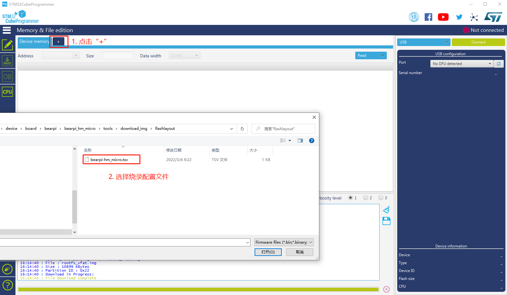

# BearPi-HM_Micro开发板编译调试

## 获取源码
```
repo init -u git@gitee.com:openharmony/manifest.git -b master --no-repo-verify
repo sync -c
repo forall -c 'git lfs pull'
./build/prebuilts_download.sh
```
## 源码编译

1. 在源码目录下输入以下指令。
    ```
    hb set

    bearpi
        >bearpi_hm_micro

    选择bearpi_hm_micro

    hb build --tee -f
    ```

2. 查看编译出的固件位置

    当编译完后，在Windows中可以直接查看到最终编译的固件，具体路径在：
    `\out\bearpi-hm_micro\bearpi-hm_micro`
    其中有以下文件是后面烧录系统需要使用的。
    
    * OHOS_Image.stm32：系统镜像文件
    * rootfs_vfat.img：根文件系统
    * userfs_vfat.img：用户文件系统


    

3. 在MobaXterm中执行以下三条指令将以上三个文件复制到`device/board/bearpi/bearpi_hm_micro/tools/download_img/kernel/`下，以便后续烧录系统使用

    ```
    cp out/bearpi_hm_micro/bearpi_hm_micro/OHOS_Image.stm32 device/board/bearpi/bearpi_hm_micro/tools/download_img/kernel/
    cp out/bearpi_hm_micro/bearpi_hm_micro/rootfs_vfat.img device/board/bearpi/bearpi_hm_micro/tools/download_img/kernel/
    cp out/bearpi_hm_micro/bearpi_hm_micro/userfs_vfat.img device/board/bearpi/bearpi_hm_micro/tools/download_img/kernel/
    ```

## 烧录镜像并启动开发板
### 一、安装软件

- 下载并安装JRE
    - 下载地址（百度云）：https://pan.baidu.com/s/1yuMn4YulfP6j50mQA8faoA 提取码：1234

- 下载并安装STM32CubeProgrammer(需要2.4.0+版本)
    - 下载地址（百度云）：https://pan.baidu.com/s/1XfFFFs7UdE9TPdN0FdA6ag 提取码：1234

### 二、连接开发板

1. 通过TypeC数据线，把电脑与BearPi-HM Micro连接。

2. 安装CH340驱动。

    下载地址：http://www.wch.cn/downloads/CH341SER_EXE.html

3. 关闭虚拟机捕获USB功能。（有很多开发者都是因为虚拟机捕获了USB设备，导致本机Windows电脑看不到串口）

    

    如果上面操作不行，直接关闭VMware Workstation，选择挂起，然后再重新插拔USB。

4. 查看开发板的串口

    

### 三、烧录镜像

1. 将开发板的拨码开关上拨到“000”烧录模式，并按一下开发板的RESET按键

    

2. 在Windows打开STM32CubeProgrammer工具，选择“USB”烧录方式，再点击刷新按钮，然后点击"Connect"。

    

3. 点击STM32CubeProgrammer工具的“+”按钮，然后选择烧录配置的tvs文件。
    
    

4. 点击Browse按钮，然后选择工程源码下的烧录镜像路径

    
    
5. 点击Download按钮启动镜像烧录，并等待烧录完毕。

    

### 四、启动开发板进入终端

1. 打开MobaXterm，
   
    1. 点击：`Session`、`Serial`按钮

    2. 设置Seral port为 第一-4 查看到的COM号

    3. 设置Speed为 `115200`

    4. 点击`OK`


    


3. 将开发板的拨码开关拨至“010”emmc启动模式，并按一下开发板的“RESET”按钮复位开发板。

    

4. MobaXterm上打印出运行日志，等待启动日志运行结束，按键盘“回车”按键进入开发板shell终端，输入例如"ls"命令，可与开发板交互。

    

5. 开发板屏幕出现桌面及预安装的"setting"应用，点击"setting"应用可查看系统信息。

    