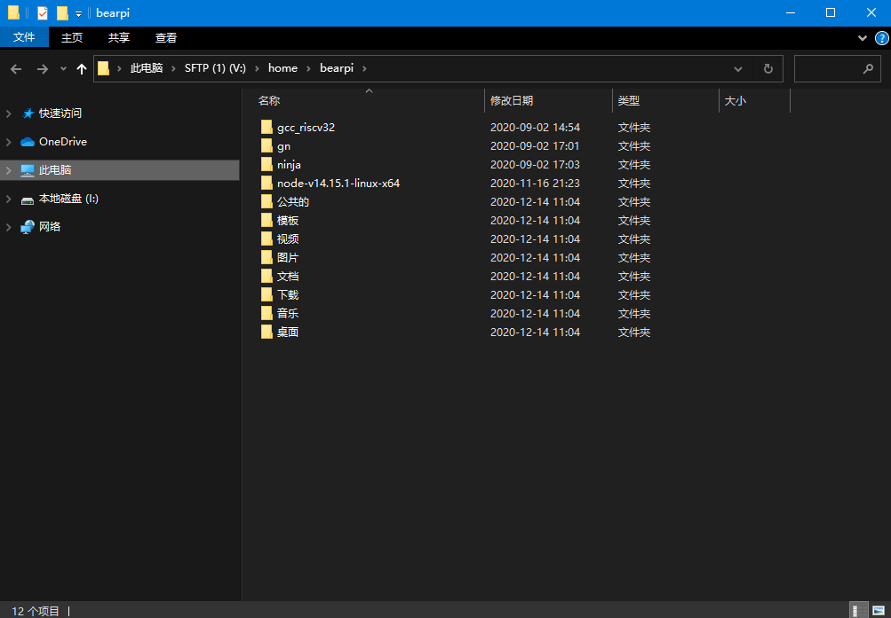

# BearPi-HM_Micro开发环境搭建<a name="ZH-CN_TOPIC_0000001054781998"></a>

## 环境要求<a name="section466851916410"></a>

### 硬件要求<a name="section07318322310"></a>

-   Linux服务器
-   Windows工作台（主机电脑）
-   BearPi-HM_Micro开发板
-   USB Type-C线（Windows工作台通过USB与BearPi-HM_Micr开发板连接）


### 软件系统要求<a name="section182305581332"></a>

**表 1**  BearPi-HM_Micro开发板开发平台要求

<a name="tc50585b2b3fe43f7835154789b0e25af"></a>
<table><thead align="left"><tr id="ra9df6acc53154b819d5f86d885d994de"><th class="cellrowborder" valign="top" width="12.41%" id="mcps1.2.5.1.1"><p id="a999bb40532eb4f74a7383e1e776bb94a"><a name="a999bb40532eb4f74a7383e1e776bb94a"></a><a name="a999bb40532eb4f74a7383e1e776bb94a"></a>硬件</p>
</th>
<th class="cellrowborder" valign="top" width="12.389999999999999%" id="mcps1.2.5.1.2"><p id="ae63cf791fbe348d3b907d20fc4927df8"><a name="ae63cf791fbe348d3b907d20fc4927df8"></a><a name="ae63cf791fbe348d3b907d20fc4927df8"></a>软件</p>
</th>
<th class="cellrowborder" valign="top" width="46.21%" id="mcps1.2.5.1.3"><p id="a54c4c80c43c84cb187342865a1d2b51e"><a name="a54c4c80c43c84cb187342865a1d2b51e"></a><a name="a54c4c80c43c84cb187342865a1d2b51e"></a>描述</p>
</th>
<th class="cellrowborder" valign="top" width="28.99%" id="mcps1.2.5.1.4"><p id="a11e8d096fb204378a63d8805cd6d1f88"><a name="a11e8d096fb204378a63d8805cd6d1f88"></a><a name="a11e8d096fb204378a63d8805cd6d1f88"></a>备注</p>
</th>
</tr>
</thead>
<tbody><tr id="row117591159175819"><td class="cellrowborder" valign="top" width="12.41%" headers="mcps1.2.5.1.1 "><p id="a0c1290183f2548898dbfc516a4db2c4b"><a name="a0c1290183f2548898dbfc516a4db2c4b"></a><a name="a0c1290183f2548898dbfc516a4db2c4b"></a>Linux编译服务器</p>
</td>
<td class="cellrowborder" valign="top" width="12.389999999999999%" headers="mcps1.2.5.1.2 "><p id="a687efa8001f140488dc1da9a2ee8f6d1"><a name="a687efa8001f140488dc1da9a2ee8f6d1"></a><a name="a687efa8001f140488dc1da9a2ee8f6d1"></a>操作系统</p>
</td>
<td class="cellrowborder" valign="top" width="46.21%" headers="mcps1.2.5.1.3 "><p id="ace724e00c9094eccb8c600d6ad426ed8"><a name="ace724e00c9094eccb8c600d6ad426ed8"></a><a name="ace724e00c9094eccb8c600d6ad426ed8"></a>Ubuntu16.04及以上64位系统版本，Shell使用bash</p>
</td>
<td class="cellrowborder" rowspan="2" valign="top" width="28.99%" headers="mcps1.2.5.1.4 "><p id="a4d0e2c8444484554ab58949ce322be32"><a name="a4d0e2c8444484554ab58949ce322be32"></a><a name="a4d0e2c8444484554ab58949ce322be32"></a>开发人员可以在Windows工作台中进行程序开发，或者远程登录到Linux服务器进行程序开发。</p>
</td>
</tr>
<tr id="r85c4bf56ff3244e48db9d2f5b622b340"><td class="cellrowborder" valign="top" headers="mcps1.2.5.1.1 "><p id="a8e99fd0262cb4489b70cf86c2144c294"><a name="a8e99fd0262cb4489b70cf86c2144c294"></a><a name="a8e99fd0262cb4489b70cf86c2144c294"></a>Windows工作台</p>
</td>
<td class="cellrowborder" valign="top" headers="mcps1.2.5.1.2 "><p id="a44d6164ce2e9421f9ade362f600c2815"><a name="a44d6164ce2e9421f9ade362f600c2815"></a><a name="a44d6164ce2e9421f9ade362f600c2815"></a>操作系统</p>
</td>
<td class="cellrowborder" valign="top" headers="mcps1.2.5.1.3 "><p id="a1c17349e334a44ada5c5f150457fe17d"><a name="a1c17349e334a44ada5c5f150457fe17d"></a><a name="a1c17349e334a44ada5c5f150457fe17d"></a>Windows XP/Windows7/Windows10</p>
</td>
</tr>
</tbody>
</table>

### Linux构建工具要求<a name="section20374218687"></a>

Linux服务器通用环境配置需要的工具及其获取途径如下表所示。

**表 2**  Linux服务器开发工具及获取途径

<a name="table6299192712513"></a>
<table><thead align="left"><tr id="row122993276512"><th class="cellrowborder" valign="top" width="25.562556255625562%" id="mcps1.2.4.1.1"><p id="p1829914271858"><a name="p1829914271858"></a><a name="p1829914271858"></a>开发工具</p>
</th>
<th class="cellrowborder" valign="top" width="20.7020702070207%" id="mcps1.2.4.1.2"><p id="p429918274517"><a name="p429918274517"></a><a name="p429918274517"></a>用途</p>
</th>
<th class="cellrowborder" valign="top" width="53.73537353735374%" id="mcps1.2.4.1.3"><p id="p12997271757"><a name="p12997271757"></a><a name="p12997271757"></a>获取途径</p>
</th>

</tr>
<tr id="row430016273514"><td class="cellrowborder" valign="top" width="25.562556255625562%" headers="mcps1.2.4.1.1 "><p id="p330015271158"><a name="p330015271158"></a><a name="p330015271158"></a>Python3.7+</p>
</td>
<td class="cellrowborder" valign="top" width="20.7020702070207%" headers="mcps1.2.4.1.2 "><p id="p43003270510"><a name="p43003270510"></a><a name="p43003270510"></a>编译构建工具</p>
</td>
<td class="cellrowborder" valign="top" width="53.73537353735374%" headers="mcps1.2.4.1.3 "><p id="p18254155164617"><a name="p18254155164617"></a><a name="p18254155164617"></a><a href="https://www.python.org/ftp/python/3.8.5/Python-3.8.5.tgz" target="_blank" rel="noopener noreferrer">https://www.python.org/ftp/python/3.8.5/Python-3.8.5.tgz</a></p>
</td>

</tr>
<tr id="row42668197206"><td class="cellrowborder" valign="top" width="25.562556255625562%" headers="mcps1.2.4.1.1 "><p id="p426711912014"><a name="p426711912014"></a><a name="p426711912014"></a>bash</p>
</td>
<td class="cellrowborder" valign="top" width="20.7020702070207%" headers="mcps1.2.4.1.2 "><p id="p14267131962014"><a name="p14267131962014"></a><a name="p14267131962014"></a>命令处理器</p>
</td>
<td class="cellrowborder" valign="top" width="53.73537353735374%" headers="mcps1.2.4.1.3 "><p id="p14267101962014"><a name="p14267101962014"></a><a name="p14267101962014"></a>通过互联网获取</p>
</td>


</tr>
</tbody>
</table>

### Windows开发工具要求<a name="section11161833102716"></a>

**表 3**  Windows工作台开发工具及获取途径

<a name="table1313323311274"></a>
<table><thead align="left"><tr id="row3133133312711"><th class="cellrowborder" valign="top" width="16.371637163716375%" id="mcps1.2.4.1.1"><p id="p16132203372716"><a name="p16132203372716"></a><a name="p16132203372716"></a>开发工具</p>
</th>
<th class="cellrowborder" valign="top" width="50.29502950295029%" id="mcps1.2.4.1.2"><p id="p1413219339278"><a name="p1413219339278"></a><a name="p1413219339278"></a>用途</p>
</th>
<th class="cellrowborder" valign="top" width="33.33333333333333%" id="mcps1.2.4.1.3"><p id="p17133183312711"><a name="p17133183312711"></a><a name="p17133183312711"></a>获取途径</p>
</th>
</tr>
</thead>
<tbody><tr id="row138432533451"><td class="cellrowborder" valign="top" width="16.371637163716375%" headers="mcps1.2.4.1.1 "><p id="p163612016916"><a name="p163612016916"></a><a name="p163612016916"></a>Visual Studio Code</p>
</td>
<td class="cellrowborder" valign="top" width="50.29502950295029%" headers="mcps1.2.4.1.2 "><p id="p1563690791"><a name="p1563690791"></a><a name="p1563690791"></a>代码编辑工具。</p>
</td>
<td class="cellrowborder" valign="top" width="33.33333333333333%" headers="mcps1.2.4.1.3 "><p id="p146361701097"><a name="p146361701097"></a><a name="p146361701097"></a><a href="https://code.visualstudio.com/" target="_blank" rel="noopener noreferrer">https://code.visualstudio.com/</a></p>
</td>

</tr>
<tr id="row18342145821513"><td class="cellrowborder" valign="top" width="16.371637163716375%" headers="mcps1.2.4.1.1 "><p id="p123421958131517"><a name="p123421958131517"></a><a name="p123421958131517"></a>MobaXterm、PuTTY或其他超级终端（选其一）</p>
</td>
<td class="cellrowborder" valign="top" width="50.29502950295029%" headers="mcps1.2.4.1.2 "><p id="p18342658131511"><a name="p18342658131511"></a><a name="p18342658131511"></a>远程连接Linux编译服务器，连接模组串口工具。</p>
</td>
<td class="cellrowborder" valign="top" width="33.33333333333333%" headers="mcps1.2.4.1.3 "><p id="p17342125851518"><a name="p17342125851518"></a><a name="p17342125851518"></a>通过互联网获取（如：<a href="https://mobaxterm.mobatek.net/" target="_blank" rel="noopener noreferrer">https://mobaxterm.mobatek.net/</a>）</p>
</td>
</tr>
<tr id="row244884215147"><td class="cellrowborder" valign="top" width="16.371637163716375%" headers="mcps1.2.4.1.1 "><p id="p1044974291416"><a name="p1044974291416"></a><a name="p1044974291416"></a>CH341SER.EXE</p>
</td>
<td class="cellrowborder" valign="top" width="50.29502950295029%" headers="mcps1.2.4.1.2 "><p id="p94491342131413"><a name="p94491342131413"></a><a name="p94491342131413"></a>USB转串口驱动。</p>
</td>
<td class="cellrowborder" valign="top" width="33.33333333333333%" headers="mcps1.2.4.1.3 "><p id="p6449184214148"><a name="p6449184214148"></a><a name="p6449184214148"></a><a href="http://www.wch.cn/search?q=ch340g&amp;t=downloads" target="_blank" rel="noopener noreferrer">http://www.wch.cn/search?q=ch340g&amp;t=downloads</a></p>
</td>
</tr>
<tr id="row18342145821513"><td class="cellrowborder" valign="top" width="16.371637163716375%" headers="mcps1.2.4.1.1 "><p id="p123421958131517"><a name="p123421958131517"></a><a name="p123421958131517"></a>STM32CubeProgrammer</p>
</td>
<td class="cellrowborder" valign="top" width="50.29502950295029%" headers="mcps1.2.4.1.2 "><p id="p18342658131511"><a name="p18342658131511"></a><a name="p18342658131511"></a>代码烧录工具。</p>
</td>
<td class="cellrowborder" valign="top" width="33.33333333333333%" headers="mcps1.2.4.1.3 "><p id="p6449184214148"><a name="p6449184214148"></a><a name="p6449184214148"></a><a href="https://pan.baidu.com/s/1y6ev83VV7mk7RMigdBDMmw?pwd=1234" target="_blank" rel="noopener noreferrer">https://pan.baidu.com/s/1y6ev83VV7mk7RMigdBDMmw?pwd=1234</a>密码：1234</p>
</td>
</tr>
</tbody>
</table>

## 安装编译基础环境<a name="section497484245614"></a>

### 一、连接Linux服务器<a name="section15541530155711"></a>

使用Windows远程登录Linux，以MobaXterm工具为例：

1.  打开[MobaXterm工具](https://mobaxterm.mobatek.net/)，    输入Linux服务器IP地址，后点击“OK”，打开连接。

    **图 2**  MobaXterm界面示例图<a name="f825e6d7569cc487db9b744e454c7157a"></a> 

    

2.  弹框告警选择“是\(Y\)”。
3.  弹出界面中输入账号并按回车键，继续输入密码并回车键。

    **图 3**  登录界面图<a name="fe1428afffbdd45f9b4a39497691ff5ff"></a>  
    

4.  登录成功。

    **图 4**  登录成功界面<a name="f11bea69483e14bd39fef4a10b1ed1a3a"></a>  
    


### 二、将Linux shell改为bash<a name="section182814544221"></a>

查看shell是否为bash，在终端运行如下命令

```
ls -l /bin/sh
```

如果为显示为/bin/sh -\> bash则为正常，否则请按以下方式修改：

**方法一**：在终端运行如下命令，然后选择 no。

```
sudo dpkg-reconfigure dash
```

**方法二**：先删除sh，再创建软链接。

```
rm -rf /bin/sh
sudo ln -s /bin/bash /bin/sh
```

### 三、修改镜像源(可选)

1. 打开/etc/apt路径下的sources.list文件

    

2. 将原本的镜像源改为中科大镜像源,然后关闭文件并保存

    

    ```
    deb https://mirrors.ustc.edu.cn/ubuntu/ bionic main restricted universe multiverse
    deb-src https://mirrors.ustc.edu.cn/ubuntu/ bionic main restricted universe multiverse
    deb https://mirrors.ustc.edu.cn/ubuntu/ bionic-updates main restricted universe multiverse
    deb-src https://mirrors.ustc.edu.cn/ubuntu/ bionic-updates main restricted universe multiverse
    deb https://mirrors.ustc.edu.cn/ubuntu/ bionic-backports main restricted universe multiverse
    deb-src https://mirrors.ustc.edu.cn/ubuntu/ bionic-backports main restricted universe multiverse
    deb https://mirrors.ustc.edu.cn/ubuntu/ bionic-security main restricted universe multiverse
    deb-src https://mirrors.ustc.edu.cn/ubuntu/ bionic-security main restricted universe multiverse
    deb https://mirrors.ustc.edu.cn/ubuntu/ bionic-proposed main restricted universe multiverse
    deb-src https://mirrors.ustc.edu.cn/ubuntu/ bionic-proposed main restricted universe multiverse
    ```

3. 更新镜像源

    ```
    sudo apt-get update
    ```
### 四、安装必要的库和工具
- 使用如下apt-get命令安装编译所需的必要的库和工具：

    ```
    sudo apt-get install build-essential gcc g++ make zlib* libffi-dev e2fsprogs pkg-config flex bison perl bc openssl libssl-dev libelf-dev libc6-dev-amd64 binutils binutils-dev libdwarf-dev u-boot-tools mtd-utils gcc-arm-linux-gnueabi cpio device-tree-compiler net-tools openssh-server git vim openjdk-11-jre-headless
    ```
### 五、安装Python3

1.  打开Linux编译服务器终端。
2.  输入如下命令，查看python版本号,若为python3.7+可跳过安装Python3步骤：

    ```
    python3 --version
    ```

    如果低于python3.7版本，不建议直接升级，请按照如下步骤重新安装。以python3.8为例，按照以下步骤安装python。

    1.  运行如下命令，查看Ubuntu版本：

        ```
        cat /etc/issue
        ```

    2.  根据Ubuntu不同版本，安装python。
        -   如果Ubuntu 版本为18+，运行如下命令。

            ```
            sudo apt-get install python3.8
            ```

        -   如果Ubuntu版本为16。

            a. 安装依赖包

            ```
            sudo apt update && sudo apt install software-properties-common
            ```

            b. 添加deadsnakes PPA 源，然后按回车键确认安装。

            ```
            sudo add-apt-repository ppa:deadsnakes/ppa
            ```

            c. 安装python3.8

            ```
            sudo apt upgrade && sudo apt install python3.8
            ```


3.  设置python和python3软链接为python3.8。

    ```
    sudo update-alternatives --install /usr/bin/python python /usr/bin/python3.8 1
    sudo update-alternatives --install /usr/bin/python3 python3 /usr/bin/python3.8 1
    ```

4.  安装并升级Python包管理工具（pip3），任选如下一种方式。
    -   **命令行方式：**

        ```
        sudo apt-get install python3-setuptools python3-pip -y
        sudo pip3 install --upgrade pip
        ```

    -   **安装包方式：**

        ```
        curl https://bootstrap.pypa.io/get-pip.py -o get-pip.py
        python get-pip.py
        ```

### 六、安装hb

1.  运行如下命令安装hb

    ```
    python3 -m pip install --user ohos-build
    ```

2.  设置环境变量

    ```
    vim ~/.bashrc
    ```

    将以下命令拷贝到.bashrc文件的最后一行，保存并退出。

    ```
    export PATH=~/.local/bin:$PATH
    ```

    执行如下命令更新环境变量。

    ```
    source ~/.bashrc
    ```
3.  执行"hb -h"，有打印以下信息即表示安装成功：

    ```
    usage: hb
    
    OHOS build system
    
    positional arguments:
      {build,set,env,clean}
        build               Build source code
        set                 OHOS build settings
        env                 Show OHOS build env
        clean               Clean output
    
    optional arguments:
      -h, --help            show this help message and exit
    ```

### 七、把ubuntu文件远程映射到Windows上

1. 安装RaiDrive软件
- 下载地址：https://forspeed.rbread05.cn/down/newdown/5/28/RaiDrive.rar   
   
    默认安装即可。

2. 打开软件切换为中文语言

    

3. 添加链接信息

    * 取消勾选只读
    * SFTP://______ （这个输入 三.9 获取到的地址）
    * 账户：账号和密码皆为 bearpi   
    * 其他默认
    * 点击`确定`

    

4. 查看本地映射的ubuntu文件路径

    

