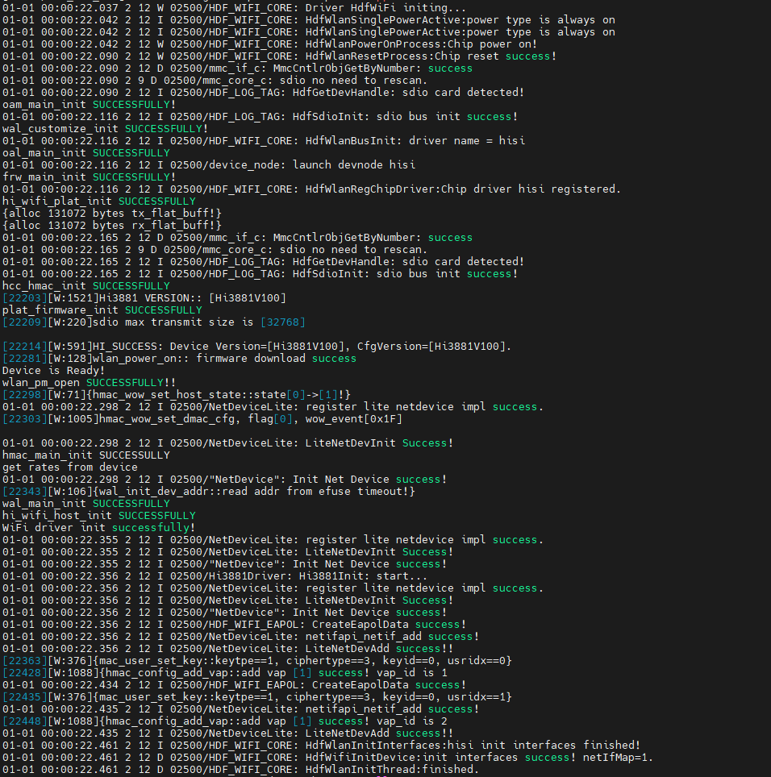

# 开发板Wi-Fi功能使用指导

## 一、准备工作

- [编译烧录](BearPi-HM_Micro开发板编译调试.md)最新代码
- 准备一个 2.4G 的 Wi-Fi 热点（支持手机热点，如果AP配置的2.4G热点无法关联需要考虑兼容性问题，尝试更换别的品牌AP再做验证）

## 二、连接Wi-Fi

### 方法一：使用桌面setting应用连接Wi-Fi

**注: 官方给的setting应用联网后退出wifi会断开，而且有概率会导致系统跑崩。**

1. 当前桌面setting应用连接WiFi SSID的键盘仅支持数字键盘，需要配置2.4G Wi-Fi 的密码为纯数字

2. 系统启动后会需要等一段时间才会加载wifi，若看到以下片段日志，说明wifi已经加载好后，然后再用setting应用去联网



### 方法二：使用CLI命令连接Wi-Fi


1. 修改`device/board/bearpi/bearpi_hm_micro/app/communication/wpa_supplicant/config/w
pa_supplicant.conf` 中的ssid和psk为创建的2.4G WiFi 热点名称及密码（非纯数字的密码也可以）

    ```
    country=GB
    ctrl_interface=udp
    network={
        ssid="bearpi"
        psk="0987654321"
    }
    ```

2. 如果步骤1中对 `wpa_supplicant.conf` 做了修改，需要重新编译生成固件
3. 烧写固件到micro开发板
2. 在micro开发板CLI下执行以下命令连接Wi-Fi
    ```
    ./bin/wpa_supplicant -i wlan0 -d -c /etc/wpa_supplicant.conf &
    ```

    串口有如下提示信息时表示关联成功
    ```sh
    WifiWpaEventScanDoneProcess done
    wlan0: Trying to associate with ec:f8:eb:e9:c3:a5 (SSID='bearpi' freq=2447 MHz)
    ifiDriverEventProcess event=5
    wlan0: State: SCANNING -> ASSOCIATING

    hilog ringbuffer full, drop 2 line(s) log
    [2791046][W:3153]{wal_cfg80211_connect::start new conn,ssid_len=16,auth_type=0,privacy=1,mfp=0}
    [2791137][W:692]{hmac_user_add::user[2] mac:XX:XX:XX:E9:C3:A5}
    WifiWpaAssociate done ret=0

    01-01 00:46:30.838 15 75 I 02500/HDF_WIFI_CORE: WifiEventReport: WifiEventReport send event = 5, ifName = wlan0
    01-01 00:46:30.838 15 75 I 02500/HDF_WIFI_CORE: OnWiFiEvents: WifiDriverEventProcess event=5
    ...

    wlan0: State: ASSOCIATING -> ASSOCIATED
    wlan0: Associated with ec:f8:eb:e9:c3:a6
    wlan0: CTRL-EVENT-SUBNET-STATUS-UPDATE status=0
    WifiWpaEventConnectResultProcess done
    WifiWpaDriverEventEapolRecvProcess call

    ...

    rx_callback
    wlan0: Event EAPOL_RX (23) received
    wlan0: State: COMPLETED -> 4WAY_HANDSHAKE
    [2794831][W:1580]{hmac_tx_lan_to_wlan:type:6,len:113}[0~3:dhcp 4:arp_req 5:arp_rsp 6:eapol]
    WifiWpaWpaSendEapol done ret=0
    wlan0: State: 4WAY_HANDSHAKE -> GROUP_HANDSHAKE
    wlan0: WPA: Key negotiation completed with ec:f8:eb:e9:c3:a5 [PTK=CCMP GTK=TKIP]
    wlan0: State: GROUP_HANDSHAKE -> COMPLETED
    WifiWpaReceiveEapol done

    ```

    联网验证
    ```sh
    OHOS # ping www.baidu.com
    [2871646][W:1580]{hmac_tx_lan_to_wlan:type:4,len:42}[0~3:dhcp 4:arp_req 5:arp_rsp 6:eapol]
    [2871765][W:1580]{hmac_tx_lan_to_wlan:type:4,len:42}[0~3:dhcp 4:arp_req 5:arp_rsp 6:eapol]
    [2871772][W:635]{hmac_rx_lan_frame_classify:user=2,type=5,len=62}[0~3dhcp 4arp_req 5arp_rsp 6eapol]
    [2871781][W:635]{hmac_rx_lan_frame_classify:user=2,type=5,len=62}[0~3dhcp 4arp_req 5arp_rsp 6eapol]

    Ping: destination unreachable ...[2874767][W:556]hisi_customize_wifi::[ba buffer size:64]

    [1]Reply from 220.181.38.149: time=7ms TTL=55[2875274][W:861]{hmac_mgmt_tx_delba:tid=0 ba_tx_info null}
    [2875278][W:850]{hmac_ba_reset_tx_handle::tx ba not set yet.}
    [2875283][W:1182]{hmac_mgmt_rx_addba_rsp::tx ba info null.tid[0]}
    [2875774][W:556]hisi_customize_wifi::[ba buffer size:64]

    [2]Reply from 220.181.38.149: time<1ms TTL=55[2876275][W:861]{hmac_mgmt_tx_delba:tid=0 ba_tx_info null}
    [2876279][W:850]{hmac_ba_reset_tx_handle::tx ba not set yet.}
    [2876284][W:1182]{hmac_mgmt_rx_addba_rsp::tx ba info null.tid[0]}
    [2876775][W:556]hisi_customize_wifi::[ba buffer size:64]
    [2876775][W:635]{hmac_rx_lan_frame_classify:user=2,type=4,len=60}[0~3dhcp 4arp_req 5arp_rsp 6eapol]

    [3]Reply from 220.181.38.149: time<1ms TTL=55
    --- 220.181.38.149 ping statistics ---
    4 packets transmitted, 3 received, 1 loss

    ```