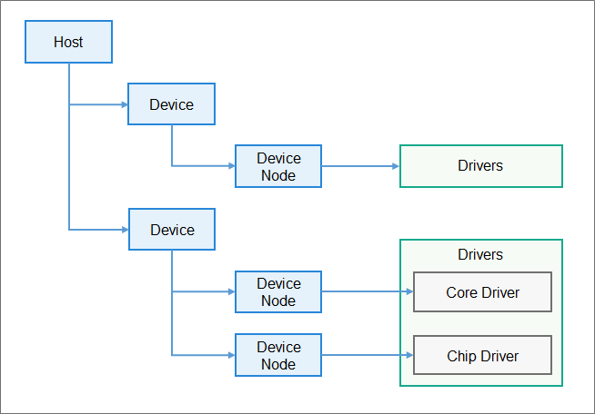

# 编写点亮LED灯程序

在本示例将演示如何在开发板上运行一个控制LED灯的程序，达到能关闭灯、开启灯以及翻转灯的状态。希望通过本教程的学习，开发者能掌握如何开发一个设备驱动，以及如何在应用层调用驱动。

**注:** 在学习本教程之前，请确保已经熟练掌握[如何编写一个hello_world应用](./编写一个hello_world程序.md)，以下教程篇幅较长，请耐心仔细阅读。

## 任务介绍
点亮LED主要包含以下任务：

1. LED驱动代码开发

    驱动开发主要包含以下工作
    
    - 编写驱动代码
    - 编写驱动编译文件
    - 编写驱动配置文件

2. 点亮LED业务代码开发

    业务代码开发主要包含以下工作
    - 编写业务代码
    -    编写业务代码编译文件

    


## 一、LED灯驱动开发

1. HDF驱动简介

    HDF框架以组件化的驱动模型作为核心设计思路，为开发者提供更精细化的驱动管理，让驱动开发和部署更加规范。HDF框架将一类设备驱动放在同一个host里面，开发者也可以将驱动功能分层独立开发和部署，支持一个驱动多个node，HDF驱动模型如下图所示：

    

2.  确定目录结构。

    在device\soc\st\common\platform路径下新建led文件夹，并创建驱动文件led.c和编译构建文件BUILD.gn、Makefile。

    ```
    .
    └── device
        └── soc
            └── st
                └── common
                   └── platform
                        └── led
                            │── led.c
                            └── BUILD.gn
                            └── Makefile

    ```

    在device\soc\st\stm32mp1xx\sdk_liteos\hdf_config路径下新建led文件夹，并创建驱动配置文件led_config.hcs。
    ```
    .
    └── device
        └── soc
            └── st
                └── stm32mp1xx
                    └── sdk_liteos
                        └── hdf_config
                            └── led
                                │── led_config.hcs
    ```

3. LED驱动实现

    驱动实现包含驱动业务代码和驱动入口注册，在led.c文件中添加以下代码：

    ```
    #include "hdf_device_desc.h" 
    #include "hdf_log.h"         
    #include "device_resource_if.h"
    #include "osal_io.h"
    #include "osal.h"
    #include "osal_mem.h"
    #include "gpio_if.h"

    #define HDF_LOG_TAG led_driver // 打印日志所包含的标签，如果不定义则用默认定义的HDF_TAG标签
    #define LED_WRITE_READ 1       // 读写操作码1

    enum LedOps {
        LED_OFF,
        LED_ON,  
        LED_TOGGLE,
    };

    struct Stm32Mp1ILed {
        uint32_t gpioNum;
    };
    static struct Stm32Mp1ILed g_Stm32Mp1ILed;
    uint8_t status = 0;
    // Dispatch是用来处理用户态发下来的消息
    int32_t LedDriverDispatch(struct HdfDeviceIoClient *client, int cmdCode, struct HdfSBuf *data, struct HdfSBuf *reply)
    {
        uint8_t contrl;
        HDF_LOGE("Led driver dispatch");
        if (client == NULL || client->device == NULL)
        {
            HDF_LOGE("Led driver device is NULL");
            return HDF_ERR_INVALID_OBJECT;
        }

        switch (cmdCode)
        {
        /* 接收到用户态发来的LED_WRITE_READ命令 */
        case LED_WRITE_READ:
            /* 读取data里的数据，赋值给contrl */
            HdfSbufReadUint8(data,&contrl);                  
            switch (contrl)
            {
            /* 开灯 */
            case LED_ON:                                            
                GpioWrite(g_Stm32Mp1ILed.gpioNum, GPIO_VAL_LOW);
                status = 1;
                break;
            /* 关灯 */
            case LED_OFF:                                           
                GpioWrite(g_Stm32Mp1ILed.gpioNum, GPIO_VAL_HIGH);
                status = 0;
                break;
            /* 状态翻转 */
            case LED_TOGGLE:
                if(status == 0)
                {
                    GpioWrite(g_Stm32Mp1ILed.gpioNum, GPIO_VAL_LOW);
                    status = 1;
                }
                else
                {
                    GpioWrite(g_Stm32Mp1ILed.gpioNum, GPIO_VAL_HIGH);
                    status = 0;
                }                                        
                break;
            default:
                break;
            }
            /* 把LED的状态值写入reply, 可被带至用户程序 */
            if (!HdfSbufWriteInt32(reply, status))                
            {
                HDF_LOGE("replay is fail");
                return HDF_FAILURE;
            }
            break;
        default:
            break;
        }
        return HDF_SUCCESS;
    }

    // 读取驱动私有配置
    static int32_t Stm32LedReadDrs(struct Stm32Mp1ILed *led, const struct DeviceResourceNode *node)
    {
        int32_t ret;
        struct DeviceResourceIface *drsOps = NULL;

        drsOps = DeviceResourceGetIfaceInstance(HDF_CONFIG_SOURCE);
        if (drsOps == NULL || drsOps->GetUint32 == NULL) {
            HDF_LOGE("%s: invalid drs ops!", __func__);
            return HDF_FAILURE;
        }
        /* 读取led.hcs里面led_gpio_num的值 */
        ret = drsOps->GetUint32(node, "led_gpio_num", &led->gpioNum, 0); 
        if (ret != HDF_SUCCESS) {
            HDF_LOGE("%s: read led gpio num fail!", __func__);
            return ret;
        }
        return HDF_SUCCESS;
    }

    //驱动对外提供的服务能力，将相关的服务接口绑定到HDF框架
    int32_t HdfLedDriverBind(struct HdfDeviceObject *deviceObject)
    {
        if (deviceObject == NULL)
        {
            HDF_LOGE("Led driver bind failed!");
            return HDF_ERR_INVALID_OBJECT;
        }
        static struct IDeviceIoService ledDriver = {
            .Dispatch = LedDriverDispatch,
        };
        deviceObject->service = (struct IDeviceIoService *)(&ledDriver);
        HDF_LOGD("Led driver bind success");
        return HDF_SUCCESS;
    }

    // 驱动自身业务初始的接口
    int32_t HdfLedDriverInit(struct HdfDeviceObject *device)
    {
        struct Stm32Mp1ILed *led = &g_Stm32Mp1ILed;
        int32_t ret;

        if (device == NULL || device->property == NULL) {
            HDF_LOGE("%s: device or property NULL!", __func__);
            return HDF_ERR_INVALID_OBJECT;
        }
        /* 读取hcs私有属性值 */
        ret = Stm32LedReadDrs(led, device->property);
        if (ret != HDF_SUCCESS) {
            HDF_LOGE("%s: get led device resource fail:%d", __func__, ret);
            return ret;
        }
        /* 将GPIO管脚配置为输出 */
        ret = GpioSetDir(led->gpioNum, GPIO_DIR_OUT);
        if (ret != 0)
        {
            HDF_LOGE("GpioSerDir: failed, ret %d\n", ret);
            return ret;
        }
        HDF_LOGD("Led driver Init success");
        return HDF_SUCCESS;
    }

    // 驱动资源释放的接口
    void HdfLedDriverRelease(struct HdfDeviceObject *deviceObject)
    {
        if (deviceObject == NULL)
        {
            HDF_LOGE("Led driver release failed!");
            return;
        }
        HDF_LOGD("Led driver release success");
        return;
    }

    // 定义驱动入口的对象，必须为HdfDriverEntry（在hdf_device_desc.h中定义）类型的全局变量
    struct HdfDriverEntry g_ledDriverEntry = {
        .moduleVersion = 1,
        .moduleName = "HDF_LED",
        .Bind = HdfLedDriverBind,
        .Init = HdfLedDriverInit,
        .Release = HdfLedDriverRelease,
    };

    // 调用HDF_INIT将驱动入口注册到HDF框架中
    HDF_INIT(g_ledDriverEntry);


    ```
4. 驱动编译

    在led/BUILD.gn文件中添加以下代码，将led.c编译成hdf_led。
    ```
    import("//drivers/adapter/khdf/liteos/hdf.gni")

    hdf_driver("hdf_led") {
        sources = [
        "led.c",
        ]
    }

    ```

    在led/Makefile文件中添加以下代码，将led.c编译成hdf_led。
    ```
    include $(LITEOSTOPDIR)/config.mk
    include $(LITEOSTOPDIR)/../../drivers/adapter/khdf/liteos/lite.mk

    MODULE_NAME := hdf_led

    LOCAL_CFLAGS += $(HDF_INCLUDE)

    LOCAL_SRCS += led.c

    LOCAL_CFLAGS += -fstack-protector-strong -Wextra -Wall -Werror -fsigned-char -fno-strict-aliasing -fno-common

    include $(HDF_DRIVER)
    ```

    在/device/soc/st/common/platform/BUILD.gn文件中添加以下代码，将hdf_led编译进内核。"##start##"和"##end##"之间为新增配置（"##start##"和"##end##"仅用来标识位置，添加完配置后删除这两行）
    ```
    import("//drivers/adapter/khdf/liteos/hdf.gni")

    group("drivers") {
    deps = [
        "uart",
        "iwdg",
        "i2c",
        "gpio",
        ##start##
        "led",
        ##end##
        "stm32mp1xx_hal",
    ]
    }
    ```

    在/device/soc/st/common/platform/lite.mk文件中添加以下代码，将hdf_led编译进内核。
    ```
    LITEOS_BASELIB += -lhdf_led
    LIB_SUBDIRS    += $(ST_DRIVERS_ROOT)/led
    ```
5. 驱动配置

    HDF使用HCS作为配置描述源码，HCS详细介绍参考配置管理介绍。

    驱动配置包含两部分，HDF框架定义的驱动设备描述和驱动的私有配置信息，具体写法如下：

    -   驱动设备描述

        HDF框架加载驱动所需要的信息来源于HDF框架定义的驱动设备描述，因此基于HDF框架开发的驱动必须要在HDF框架定义的device_info.hcs配置文件中添加对应的设备描述，所以我们需要在vendor\bearpi\bearpi_hm_micro\hdf_config\device_info\device_info.hcs中添加LED设备描述。 "##start##"和"##end##"之间为新增配置（"##start##"和"##end##"仅用来标识位置，添加完配置后删除这两行）
        ```
        platform :: host {
        hostName = "platform_host";
        priority = 50;
        ##start##
        device_led :: device {                  // led设备节点
            device0 :: deviceNode {             // led驱动的DeviceNode节点
                policy = 2;                     // policy字段是驱动服务发布的策略，在驱动服务管理章节有详细介绍
                priority = 10;                 // 驱动启动优先级（0-200），值越大优先级越低，建议默认配100，优先级相同则不保证device的加载顺序
                preload = 1;                    // 驱动按需加载字段
                permission = 0777;              // 驱动创建设备节点权限
                moduleName = "HDF_LED";        // 驱动名称，该字段的值必须和驱动入口结构的moduleName值一致
                serviceName = "hdf_led";    // 驱动对外发布服务的名称，必须唯一
                deviceMatchAttr = "st_stm32mp157_led"; // 驱动私有数据匹配的关键字，必须和驱动私有数据配置表中的match_attr值相等
            }
        }  
        ##end##
        device_gpio :: device {
            device0 :: deviceNode {
                policy = 0;
                priority = 10;
                permission = 0644;
                moduleName = "HDF_PLATFORM_GPIO";
                serviceName = "HDF_PLATFORM_GPIO";
                deviceMatchAttr = "st_stm32mp157_gpio";
            }
        }
        ```
    -   驱动私有配置信息

        如果驱动有私有配置，则可以添加一个驱动的配置文件，用来填写一些驱动的默认配置信息，HDF框架在加载驱动的时候，会将对应的配置信息获取并保存在HdfDeviceObject 中的property里面，通过Bind和Init传递给驱动，所以我们需要在device\soc\st\stm32mp1xx\sdk_liteos\hdf_config\led\led_config.hcs中添加LED私有配置描述。

        ```
        root {
            LedDriverConfig {
                led_gpio_num = 13;
                match_attr = "st_stm32mp157_led";   //该字段的值必须和device_info.hcs中的deviceMatchAttr值一致
            }
        }
        ```


        配置信息定义之后，需要将该配置文件添加到板级配置入口文件vendor\bearpi\bearpi_hm_micro\hdf_config\hdf.hcs，示例如下：

        ```
        #include "../../../../device/soc/st/stm32mp1xx/sdk_liteos/hdf_config/led/led_config.hcs"
        ```
    - 小结
        1. device_info.hcs文件中的moduleName必须要和驱动文件中的moduleName字段匹配，这样驱动才会加载起来
        2. device_info.hcs文件中的deviceMatchAttr的字段必须和私有配置文件中led_config.hcs的match_attr的字段匹配，这样私有配置才能生效

        

## 二、点亮LED灯业务代码<a name="section9360141181414"></a>


1.  <a name="li5479332115116"></a>确定目录结构。

    开发者编写业务时，务必先在./device/board/bearpi/bearpi\_hm\_micro/app路径下新建一个目录（或一套目录结构），用于存放业务源码文件。

    例如：在app下新增业务my\_led\_app，其中my\_led\_app.c为业务代码，BUILD.gn为编译脚本，具体规划目录结构如下：

    ```
    .
    └── device
        └── board
            └── bearpi
                └── bearpi_hm_micro
                    └── app
                        │── my_led_app
                            │── my_led_app.c
                            └── BUILD.gn

    ```

2.  编写业务代码。

    在my_led_app.c中添加以下业务代码：

    ```
    #include <fcntl.h>
    #include <sys/stat.h>
    #include <sys/ioctl.h>
    #include <unistd.h>
    #include <stdio.h>
    #include "hdf_sbuf.h"
    #include "hdf_io_service_if.h"

    #define LED_WRITE_READ 1
    #define LED_SERVICE "hdf_led"

    static int SendEvent(struct HdfIoService *serv, uint8_t eventData)
    {
        int ret = 0;
        struct HdfSBuf *data = HdfSBufObtainDefaultSize();
        if (data == NULL)
        {
            printf("fail to obtain sbuf data!\r\n");
            return 1;
        }

        struct HdfSBuf *reply = HdfSBufObtainDefaultSize();
        if (reply == NULL)
        {
            printf("fail to obtain sbuf reply!\r\n");
            ret = HDF_DEV_ERR_NO_MEMORY;
            goto out;
        }
        /* 写入数据 */
        if (!HdfSbufWriteUint8(data, eventData))
        {
            printf("fail to write sbuf!\r\n");
            ret = HDF_FAILURE;
            goto out;
        }
        /* 通过Dispatch发送到驱动 */
        ret = serv->dispatcher->Dispatch(&serv->object, LED_WRITE_READ, data, reply);
        if (ret != HDF_SUCCESS)
        {
            printf("fail to send service call!\r\n");
            goto out;
        }

        int replyData = 0;
        /* 读取驱动的回复数据 */
        if (!HdfSbufReadInt32(reply, &replyData))
        {
            printf("fail to get service call reply!\r\n");
            ret = HDF_ERR_INVALID_OBJECT;
            goto out;
        }
        printf("\r\nGet reply is: %d\r\n", replyData);
    out:
        HdfSBufRecycle(data);
        HdfSBufRecycle(reply);
        return ret;
    }

    int main(int argc, char **argv)
    {
        int i;
        
        /* 获取服务 */
        struct HdfIoService *serv = HdfIoServiceBind(LED_SERVICE);
        if (serv == NULL)
        {
            printf("fail to get service %s!\r\n", LED_SERVICE);
            return HDF_FAILURE;
        }

        for (i=0; i < argc; i++)
        {
            printf("\r\nArgument %d is %s.\r\n", i, argv[i]);
        }

        SendEvent(serv, atoi(argv[1]));

        HdfIoServiceRecycle(serv);
        printf("exit");

        return HDF_SUCCESS;
    }
    ```

3.  编写将构建业务代码的BUILD.gn文件。

    BUILD.gn文件由三部分内容（目标、源文件、头文件路径）构成，需由开发者完成填写。以my\_led\_app为例，需要创建./device/board/bearpi/bearpi_hm_micro/app/my\_led\_app/BUILD.gn，并完如下配置。

    ```
    import("//build/lite/config/component/lite_component.gni")

    HDF_FRAMEWORKS = "//drivers/framework"

    executable("led_lib") {
        output_name = "my_led"
        sources = [
            "my_led_app.c",
        ]

        include_dirs = [
        "$HDF_FRAMEWORKS/ability/sbuf/include",
        "$HDF_FRAMEWORKS/core/shared/include",
        "$HDF_FRAMEWORKS/core/host/include",
        "$HDF_FRAMEWORKS/core/master/include",
        "$HDF_FRAMEWORKS/include/core",
        "$HDF_FRAMEWORKS/include/utils",
        "$HDF_FRAMEWORKS/utils/include",
        "$HDF_FRAMEWORKS/include/osal",
        "//drivers/adapter/uhdf/posix/include",
        "//third_party/bounds_checking_function/include",
        "//base/hiviewdfx/hilog_lite/interfaces/native/innerkits",
        ]

        deps = [
            "//base/hiviewdfx/hilog_lite/frameworks/featured:hilog_shared",
            "//drivers/adapter/uhdf/manager:hdf_core",
            "//drivers/adapter/uhdf/posix:hdf_posix_osal",
        ]
    }

    lite_component("my_led_app") {
        features = [
            ":led_lib",
        ]
    }
    ```

    -   首先导入 gni 组件，将源码my_led_app.c编译成led_lib库文件
    -   输出的可执行文件名称由 output_name 定义为my_led
    -   include_dirs 里面加入my_led_app.c里面需要用到的.h的头文件路径
    -   deps 里面加入所依赖的库。
    -   然后将led_lib打包成 lite_component，命名为my_led_app组件。

4. 修改bundle.json配置文件

    修改文件./device/board/bearpi/bearpi_hm_micro/app/bundle.json，新增编译my\_led\_app条目，如下所示，"##start##"和"##end##"之间为新增条目（"##start##"和"##end##"仅用来标识位置，添加完配置后删除这两行）：

    ```
    {
        "sub_component": [
          "//device/board/bearpi/bearpi_hm_micro/app/launcher:launcher_hap",
          "//device/board/bearpi/bearpi_hm_micro/app/setting:setting_hap",
          "//device/board/bearpi/bearpi_hm_micro/app/screensaver:screensaver_hap",
          "//device/board/bearpi/bearpi_hm_micro/app/communication:sample",
          ##start##
          "//device/board/bearpi/bearpi_hm_micro/app/my_led_app"
          ##end##

        ],
    }
    ```

## 三、运行结果

示例代码[编译、烧录](BearPi-HM_Micro开发板编译调试.md)后，在命令行输入以下指令可控制开发板的LED灯。

关闭LED:
```
./bin/my_led 0
```
开启LED:
```
./bin/my_led 1
```
翻转LED:
```
./bin/my_led 2
```

从以下日志的Get reply中可以收到驱动上报的当前灯的状态，"0"表示当前灯为关闭状态，"1"表示当前灯为打开状态，

```
OHOS #
OHOS # ./bin/my_led 0
OHOS #
Argument 0 is bin/my_led.

Argument 1 is 0.

Get reply is: 0
exit01-01 00:01:06.784 19 43 E 02500/led_driver: Led driver dispatch

OHOS #
OHOS # ./bin/my_led 1
OHOS #
Argument 0 is bin/my_led.

Argument 1 is 1.

Get reply is: 1
exit01-01 00:01:08.833 20 43 E 02500/led_driver: Led driver dispatch

OHOS #
OHOS # ./bin/my_led 2
OHOS #
Argument 0 is bin/my_led.

Argument 1 is 2.

Get reply is: 0
exit01-01 00:01:11.391 21 43 E 02500/led_driver: Led driver dispatch


```
## 总结<a name="section9712145420182"></a>

用户程序是无法直接访问驱动的，当只有驱动程序向用户态暴露server后，用户程序才能通过Dispatch的方式发送指令到驱动程序，并可以将用户态的数据携带到驱动程序，也可以从驱动程序读出数据，如下图所示为用户态程序与驱动自己数据交互的过程。


1. 发送LED_WRITE_READ命令到驱动，此处开发者可以自定义创建更多的命令。
2. 携带数据到驱动，解析出开关灯的动作。
3. 读取IO口电平状态并通过reply携带到用户程序。

在此希望开发者能仔细琢磨并掌握整个流程，掌握用户态应用程序与内核态驱动程序之间的数据交互流程，以及驱动的编写方式。
