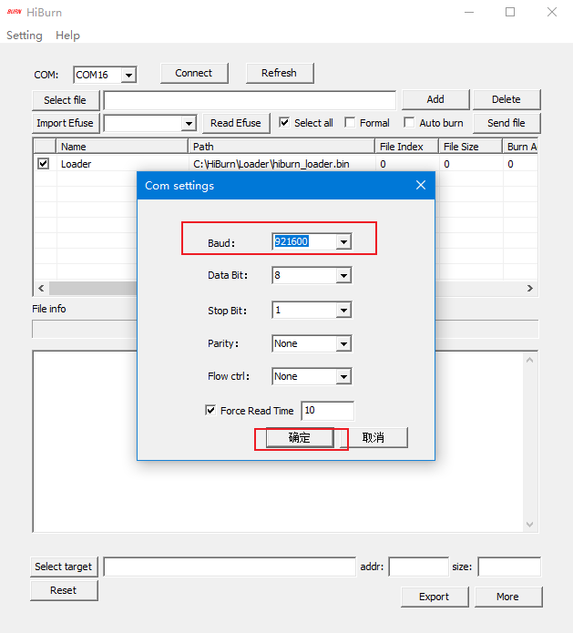
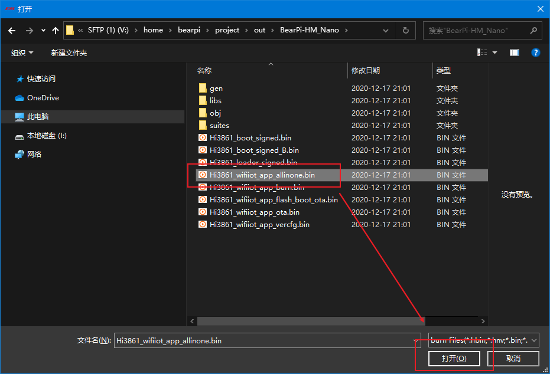
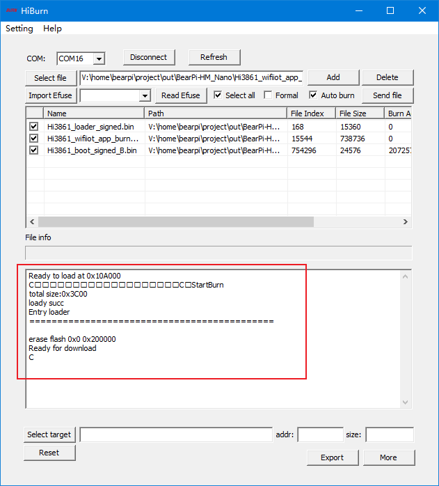
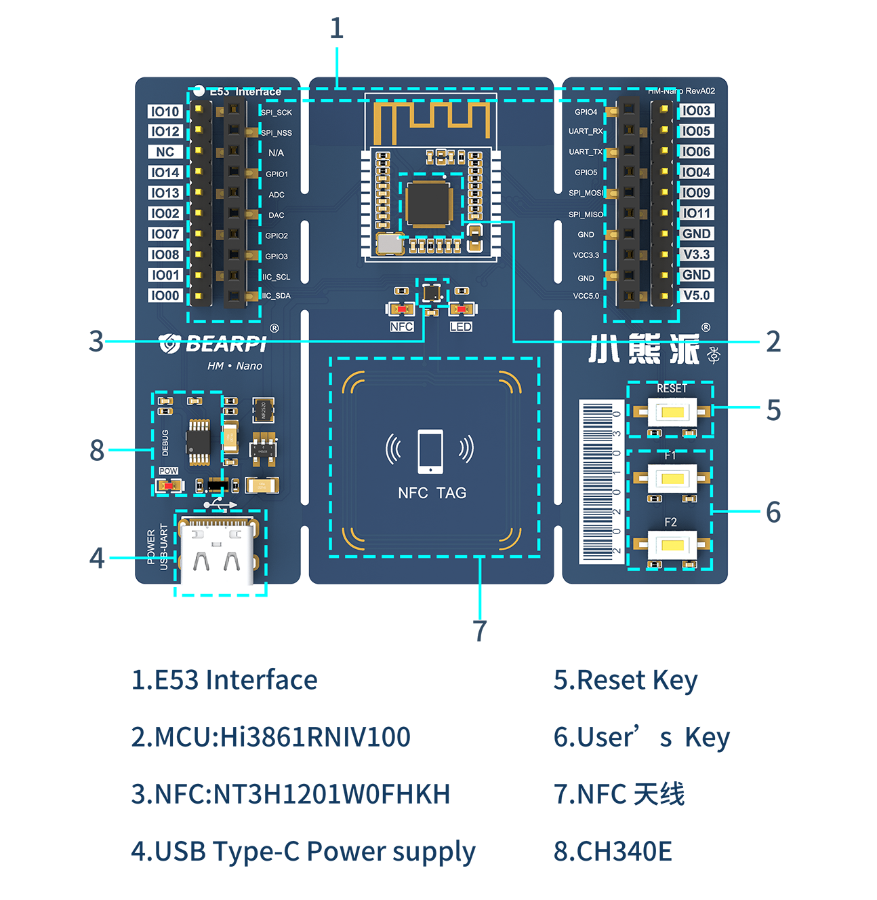

# BearPi-HM Nano<a name="ZH-CN_TOPIC_0000001130176841"></a>

-   [Get source code](#section11660541590)
-   [Construction of development environment](#section11660541591)
-   [Source code compilation](#section11660541592)
-   [Firmware burning](#section11660541593)
-   [Introduction to development board](#section11660541593)
-   [Development board details](#section12212842173518)
-   [Application](#section1464106163819)

## Get source code<a name="section11660541590"></a>
```
repo init -u git@gitee.com:openharmony/manifest.git -b master --no-repo-verify
repo sync -c
repo forall -c 'git lfs pull'
```
## Construction of development environment<a name="section11660541591"></a>
Please refer to [Hi3861 development environment construction](https://gitee.com/openharmony/docs/blob/master/en/device-dev/quick-start/quickstart-lite-steps-hi3861-setting.md)

## Source code compilation<a name="section11660541592"></a>
```
hb set

bearpi
    >bearpi_hm_nano

选择bearpi_hm_nano

hb build -f
```
## Firmware burning<a name="section11660541593"></a>
1. Open hiburn tool in windows, click 'Refresh', and select com number in 'com', as shown in the following figure。

    

    Then click 'Setting' and select 'Com settings'.

2. Set 'Baud' to '921600' in com settings, and click OK, as shown in the figure below.   

    

3. Click the 'select file' button in hiburn tool, and in the pop-up file box, select the './out/bearpi_hm_nano/bearpi_hm_nano/' file under the 'Hi3861_wifiiot_app_allinone.bin' path of the project file, as shown in the following figure.

    

4. Click the 'Auto burn' check box, and then click 'Connect', as shown in the following figure.

    

    The 'Connect' button changes to 'Disconnect' and waits for the download.

5. Reset the 'RESET' button on the development board to start downloading the program, as shown in the figure below.

    

    

    
6. Until the word "Execution Successful" appears, the program download is completed.

7. After downloading, click the 'Disconnect' button to facilitate later debugging.
## Introduction to development board<a name="section11660541593"></a>

### Development board overview

BearPi[（BearPi-HM Nano）](https://item.taobao.com/item.htm?id=633296694816)is a development board specially built by BearPi school for openharmony system. It carries a highly integrated 2.4GHz WiFi SoC chip hi3861, and carries NFC circuit and standard E53 interface. The standard E53 interface can expand cases such as intelligent humidifier, intelligent desk lamp, intelligent security, intelligent smoke detector, etc.

### Development board function
BearPi-HM Nano development board, for developers, is used for openharmony development and learning. At the same time, it provides rich cases and tutorials to realize full scene application design.

1. E53 interface: it is a standard interface with rich resources and easy to expand. It realizes multi application case expansion, making case development more flexible and convenient.

2. NFC: the on-board NFC RF circuit, combined with the key capabilities of openharmony, can perfectly realize the "touch and touch" networking mechanism and service pull-up function of openharmony system, reduce the complexity of user operation, and improve the user experience.

3. User keys: open function keys. The key functions are fully defined by the developer, which increases user operability.

## Development board details<a name="section12212842173518"></a>
The detailed functions of the development board are shown in the figure below:



## Application<a name="section1464106163819"></a>

### Development board application scenario

Bearpi_HM_Nano can be used in intelligent humidifier, intelligent desk lamp, intelligent security, intelligent smoke detector and other cases, such as the following cases.

1. Intelligent humidifier: it can monitor the current indoor temperature and humidity in real time, and can open and close the humidifier remotely and in real time.

2. Intelligent desk lamp: it can monitor the current indoor light intensity in real time. When it is lower than the predetermined threshold, the desk lamp will be turned on automatically, and the independent control of the desk lamp can be realized.

3. Intelligent security: it can monitor the movement of human body within the range in real time and report to the cloud display to realize the monitoring and alarm of intelligent security.

4. Intelligent smoke sensing: it can monitor the smoke concentration in the current room in real time and report to the cloud display. When the smoke concentration exceeds the set threshold, the alarm will trigger the alarm immediately.


## Repositories Involved<a name="section1371113476307"></a>

**device/board/bearpi/bearpi_hm_nano**

vendor/bearpi

