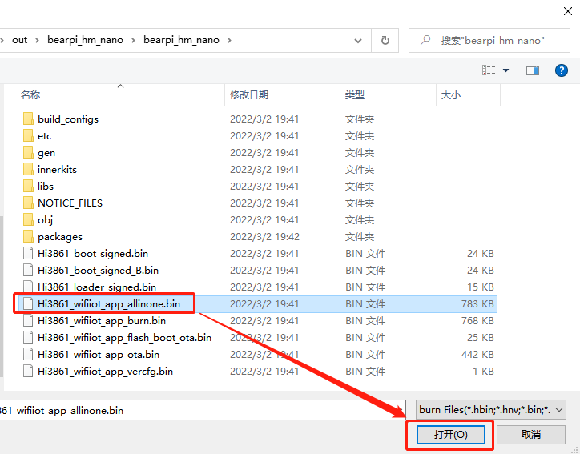
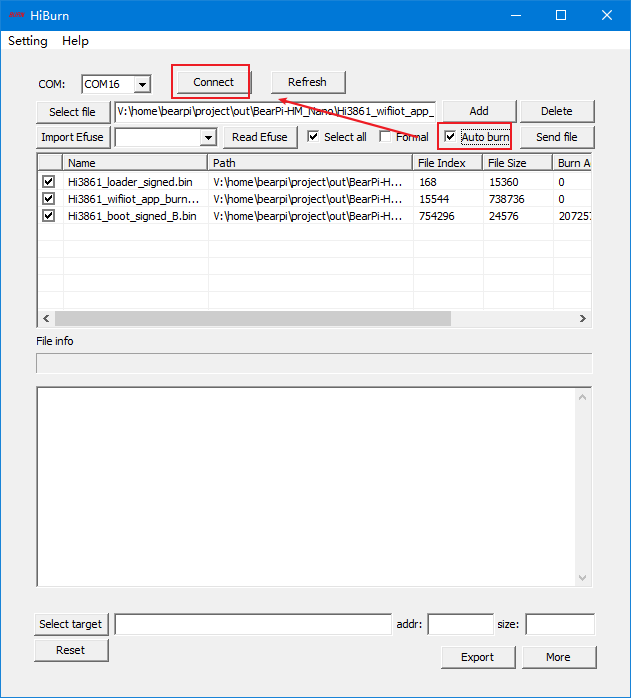
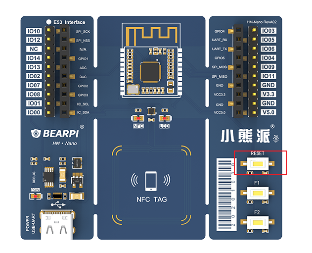

# BearPi-HM Nano<a name="ZH-CN_TOPIC_0000001130176841"></a>

-   [获取源码](#section11660541590)
-   [开发环境搭建](#section11660541591)
-   [源码编译](#section11660541592)
-   [固件烧录](#section11660541593)
-   [开发板介绍](#section11660541594)
-   [开发板详情](#section12212842173518)
-   [应用案例场景](#section1464106163819)

## 获取源码<a name="section11660541590"></a>
```
repo init -u git@gitee.com:openharmony/manifest.git -b master --no-repo-verify
repo sync -c
repo forall -c 'git lfs pull'
```
## 开发环境搭建<a name="section11660541591"></a>
请参考[Hi3861开发环境搭建](https://gitee.com/openharmony/docs/blob/master/zh-cn/device-dev/quick-start/quickstart-lite-steps-hi3861-setting.md)

## 源码编译<a name="section11660541592"></a>
```
hb set

bearpi
    >bearpi_hm_nano

选择bearpi_hm_nano

hb build -f
```
## 固件烧录<a name="section11660541593"></a>
1. 在Windows打开Hiburn工具，并点击`Refresh`，在`COM`中选择COM号，如下图所示。
- Hiburn工具下载地址（百度云）：https://pan.baidu.com/s/1i6P_LuUzclS6hlQ3XHOobQ&amp;t=downloads 提取码：1234


    

    然后点击`Setting`，并选择 `Com settings`。

2. 在Com settings中设置`Baud`为：`921600`，点击确定 ，如下图所示。   

    

3. 点击 Hiburn工具中的`Select file`按钮，在弹出的文件框中，选择工程文件`./out/bearpi_hm_nano/bearpi_hm_nano/` 路径下的`Hi3861_wifiiot_app_allinone.bin` 文件，如下图所示。

    

4. 点击`Auto burn`复选框，然后点击`Connect`，如下图所示。

    

    此时`Connect`按钮变成`Disconnect`，等待下载。

5. 复位开发板`RESET`按键，开始下载程序，如下图所示。

    

    

    
6. 直到出现`Execution Successful`字样，程序下载完成。

7. 下载完后，点击`Disconnect`按钮，便于后面调测使用。

## 开发板介绍<a name="section11660541594"></a>

### 开发板概述


小熊派[（BearPi-HM Nano）](https://item.taobao.com/item.htm?id=633296694816)是一款由小熊派专为OpenHarmony系统打造的开发板,板载高度集成的2.4GHz WiFi SoC芯片Hi3861，并板载NFC电路及标准的E53接口，标准的E53接口可扩展智能加湿器、智能台灯、智能安防、智能烟感等案例。

### 开发板功能
BearPi-HM Nano开发板，面向开发者，用于OpenHarmony开发学习，同时提供丰富案例和教程，实现全场景应用设计。

1. E53 Interface：是一种资源丰富，易于扩展的标准接口，实现多应用案例扩展，使得案例开发变得更加灵活和方便。

2. NFC：板载的NFC射频电路，配合OpenHarmony开放的关键能力，可以完美实现OpenHarmony系统的“碰一碰”联网机制和服务拉起功能，降低用户操作复杂度，从而提高用户体验。

3. 用户按键：开放式功能按键，按键功能全权由开发者定义，增加了用户可操作性。

## 开发板详情<a name="section12212842173518"></a>
开发板详细功能如下图所示：


## 应用案例场景<a name="section1464106163819"></a>

### 开发板应用场景

BearPi-HM Nano可用于智能加湿器、智能台灯、智能安防、智能烟感等案例，如以下案例。

1. 智能加湿器：可实时监测室内当前的温湿度，可实现远程实时开启和关闭加湿器。

2. 智能台灯:可实时监测当前的室内光照强度，低于预定的阈值时，自动开启台灯，并可实现对台灯的单独控制。

3. 智能安防：可实时监测范围内人体的移动，并上报云端显示，实现智能安防的监测和警报。

4. 智能烟感：可实时监测当前房间中的烟雾浓度，并上报云端显示，当烟雾浓度超过设定的阈值时，报警器立即触发警报。


## 相关仓<a name="section1371113476307"></a>

**device/board/bearpi/bearpi_hm_nano**

vendor/bearpi


