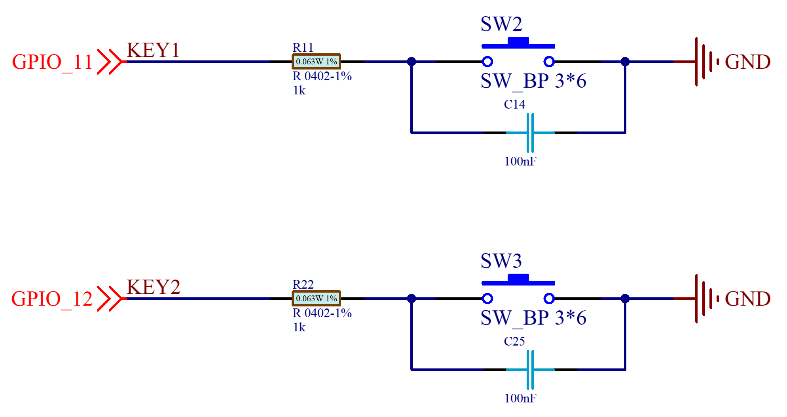

# BearPi-HM_Nano开发板基础外设开发——GPIO输入
本示例将演示如何在BearPi-HM_Nano开发板上使用GPIO输入功能去读取按键状态。

## GPIO API分析
本案例主要使用了以下几个API完成GPIO输入功能。
### IoTGpioInit()
```c
unsigned int IoTGpioInit(unsigned int id);
```
 **描述：**

初始化GPIO外设。

**参数：**

|参数名|描述|
|:--|:------|
| id | 表示GPIO引脚号。  |

### IoTGpioSetFunc()
```c
unsigned int IoTGpioSetFunc(unsigned int id, unsigned char val);
```
**描述：**

设置GPIO引脚复用功能。

**参数：**

|参数名|描述|
|:--|:------| 
| id | 表示GPIO引脚号。  |
| val | 表示GPIO复用的功能。 |

### IoTGpioSetDir()
```c
unsigned int IoTGpioSetDir(unsigned int id, IotGpioDir dir);
```
**描述：**

设置GPIO输出方向。

**参数：**

|参数名|描述|
|:--|:------| 
| id | 表示GPIO引脚号。  |
| dir | 表示该GPIO用作输入还是输出。  |


### IoTGpioSetPull()
```c
unsigned int IoTGpioSetPull(unsigned int id, IotGpioPull val);
```
**描述：**

设置GPIO的上下拉方式。

**参数：**

|参数名|描述|
|:--|:------| 
| id | 表示GPIO引脚号。  |
| val | 表示设置该GPIO为上拉或下拉。  |


### IoTGpioRegisterIsrFunc()
```c
unsigned int IoTGpioRegisterIsrFunc(unsigned int id, IotGpioIntType intType, IotGpioIntPolarity intPolarity, GpioIsrCallbackFunc func, char *arg);
```
**描述：**

启用GPIO引脚的中断功能。这个函数可以用来为GPIO pin设置中断类型、中断极性和中断回调。

**参数：**

|参数名|描述|
|:--|:------| 
| id | 表示GPIO引脚号。  |
| intType| 表示中断类型。  |
| intPolarity| 表示中断极性。 |
| func| 表示中断回调函数。  |
| arg| 表示中断回调函数中使用的参数的指针。  |


## 硬件设计
本案例将使用板载的两个用户按键来验证GPIO的输入功能，在BearPi-HM_Nano开发板上用户按键的连接电路图如下图所示，按键F1的检测引脚与主控芯片的GPIO_11连接，按键F2的检测引脚与主控芯片的GPIO_12连接，所以需要编写软件去读取GPIO_11和GPIO_12的电平值，判断按键是否被按下。



## 软件设计

**主要代码分析**

这部分代码主要分析按键触发中断的功能代码，这里以按键F1为例，按键F1的检测引脚与主控芯片的GPIO_11连接，首先通过调用IoTGpioSetFunc()和IoTGpioSetDir()将GPIO_11设置为普通GPIO的输入模式。从前面原理图可知，当按键按下时，GPIO_11会被下拉到地，所以这里要使用IoTGpioSetPull()将GPIO_11引脚设置为上拉，这样才能产生电平的跳变。最后通过IoTGpioRegisterIsrFunc()将中断类型设置为边沿触发，且为下降沿触发，当按键被按下时，GPIO_11会从高电平转为低电平，产生一个下降，这个时候就会触发中断并回调F1_Pressed函数。在F1_Pressed函数中实现点亮LED灯操作。
```c
/**
* @brief Callback for F1 key
*
*/
static void F1Pressed(char *arg)
{
    (void)arg;
    IoTGpioSetOutputVal(LED_GPIO, 1);
}

/**
* @brief Callback for F2 key
*
*/
static void F2Pressed(char *arg)
{
    (void)arg;
    IoTGpioSetOutputVal(LED_GPIO, 0);
}

/**
 * @brief Main Entry of the Button Example
 * 
 */
static void ButtonExampleEntry(void)
{
    //init gpio of LED
    IoTGpioInit(LED_GPIO);
    IoTGpioSetDir(LED_GPIO, IOT_GPIO_DIR_OUT);

    //init gpio of F1 key and set it as the falling edge to trigger interrupt
    IoTGpioInit(BUTTON_F1_GPIO);
    IoTGpioSetDir(BUTTON_F1_GPIO, IOT_GPIO_DIR_IN);
    IoTGpioSetPull(BUTTON_F1_GPIO, IOT_GPIO_PULL_UP);
    IoTGpioRegisterIsrFunc(BUTTON_F1_GPIO, IOT_INT_TYPE_EDGE, IOT_GPIO_EDGE_FALL_LEVEL_LOW, F1Pressed, NULL);

    //init gpio of F2 key and set it as the falling edge to trigger interrupt
    IoTGpioInit(BUTTON_F2_GPIO);
    IoTGpioSetDir(BUTTON_F2_GPIO, IOT_GPIO_DIR_IN);
    IoTGpioSetPull(BUTTON_F2_GPIO, IOT_GPIO_PULL_UP);
    IoTGpioRegisterIsrFunc(BUTTON_F2_GPIO, IOT_INT_TYPE_EDGE, IOT_GPIO_EDGE_FALL_LEVEL_LOW, F2Pressed, NULL);
}
```

## 编译调试

### 修改 BUILD.gn 文件


修改`device\board\bearpi\bearpi_hm_nano\app` 路径下 BUILD.gn 文件，指定 `button_example` 参与编译。

```r
#"B1_basic_led_blink:led_example",
"B2_basic_button:button_example",
#"B3_basic_pwm_led:pwm_example",
#"B4_basic_adc:adc_example",
#"B5_basic_i2c_nfc:i2c_example",
#"B6_basic_uart:uart_example",
```   


### 运行结果

示例代码编译烧录后，按下开发板的RESET按键，开发板开始正常工作，按下F1按键LED会点亮，按下F2按键LED会熄灭。


