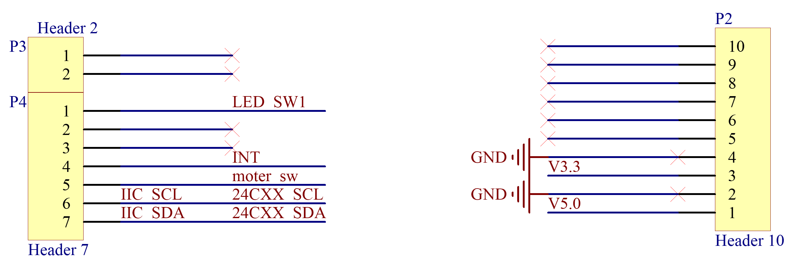

# BearPi-HM_Nano开发板传感器驱动开发——E53_IA1读取温度 、湿度、光照强度
本示例将演示如何在BearPi-HM_Nano开发板上使用E53_IA1读取温度 、湿度、光照强度，当温度 、湿度超标时开启电机通风，当光照强度过低时，开启补光灯补光，设备安装如下图所示。


## E53_IA1 API分析
本案例主要使用了以下API完成温度 、湿度、光照强度读取。
### E53IA1Init()
```C
void E53IA1Init(void)
```
 **描述：**

初始化E53_IA1

### E53IA1ReadData()
```C
void E53IA1ReadData(E53IA1Data *ReadData)
```
 **描述：**

读取温度 、湿度、光照强度。
### LightStatusSet()
```C
void LightStatusSet(E53IA1Status status)
```
 **描述：**
 
控制补光灯开关。

**参数：**

|参数名|描述|
|:--|:------| 
| status | ON打开，OFF关闭。  |

### MotorStatusSet()
```C
void MotorStatusSet(E53IA1Status status)
```
 **描述：**

控制电机开关。

**参数：**

|参数名|描述|
|:--|:------| 
| status | ON打开，OFF关闭。  |

## 硬件设计
本案例将用到 E53_IA1 智慧农业扩展板与 BearPi-HM_Nano 开发板，其中E53_IA1扩展板接口原理图如下，温湿度传感器sht30和光照强度传感器BH1750都是通过I2C来驱动，电机和补光灯分别通过GPIO_8和GPIO_14来控制。




E53_IA1 智慧农业扩展板在 BearPi-HM_Nano 开发板上的安装方法如下图所示。


## 软件设计

**主要代码分析**


首先调用 `E53IA1Init()` 函数初始化E53_IA1所接的引脚的功能，然后循环调用 `E53IA1ReadData(E53IA1Data *ReadData)` 函数读取温度 、湿度、光照强度并通过串口打印出来。当光照强度过低时，开启补光灯补光；当温度或湿度超标时开启电机通风。

```C
static void ExampleTask(void)
{
    int ret;
    E53IA1Data data;

    ret = E53IA1Init();
    if (ret != 0) {
        printf("E53_IA1 Init failed!\r\n");
        return;
    }

    while (1) {
        printf("\r\n=======================================\r\n");
        printf("\r\n*************E53_IA1_example***********\r\n");
        printf("\r\n=======================================\r\n");

        ret = E53IA1ReadData(&data);
        if (ret != 0) {
            printf("E53_IA1 Read Data failed!\r\n");
            return;
        }
        printf("\r\n******************************Lux Value is  %.2f\r\n", data.Lux);
        printf("\r\n******************************Humidity is  %.2f\r\n", data.Humidity);
        printf("\r\n******************************Temperature is  %.2f\r\n", data.Temperature);

        if ((int)data.Lux < MIN_LUX) {
            LightStatusSet(ON);
        } else {
            LightStatusSet(OFF);
        }

        if (((int)data.Humidity > MAX_HUM) | ((int)data.Temperature > MAX_TEMP)) {
            MotorStatusSet(ON);
        } else {
            MotorStatusSet(OFF);
        }
        usleep(TASK_DELAY_1S);
    }
}
```


## 编译调试

### 修改 BUILD.gn 文件
修改`device\board\bearpi\bearpi_hm_nano\app`路径下的 BUILD.gn 文件，指定 `e53_ia1_example` 参与编译。
```r
#"C1_e53_sf1_mq2:e53_sf1_example",
"C2_e53_ia1_temp_humi_pls:e53_ia1_example",
#"C3_e53_sc1_pls:e53_sc1_example",
#"C4_e53_sc2_axis:e53_sc2_example",
#"C5_e53_is1_infrared:e53_is1_example",
```


### 运行结果

示例代码编译烧录后，按下开发板的RESET按键，通过串口助手查看日志，会打印温湿度及光照强度信息。用手遮住扩展板，补光灯会自动开启，控制温度或者湿度超标，电机会自动开启。
```c
=======================================

*************E53_IA1_example***********

=======================================

******************************Lux Value is  53.33

******************************Humidity is  44.10

******************************Temperature is  28.13
=======================================

*************E53_IA1_example***********

=======================================

******************************Lux Value is  53.33

******************************Humidity is  44.10

******************************Temperature is  28.13
```

