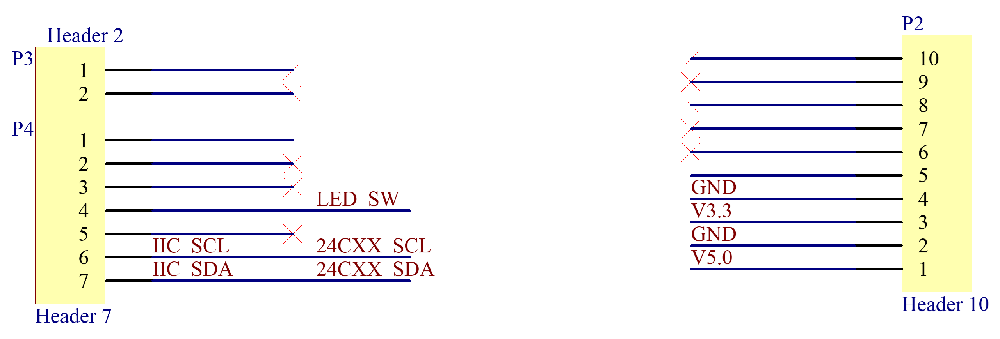

# BearPi-HM_Nano开发板传感器驱动开发——E53_SC1读取光照强度
本示例将演示如何在BearPi-HM_Nano开发板上使用E53_SC1读取温度 、湿度、光照强度，当光照强度过低时，开启补光灯补光，设备安装如下图所示。


## E53_SC1 API分析
本案例主要使用了以下API完成温度 、湿度、光照强度读取。
### E53SC1Init()
```C
int E53SC1Init(void);
```
 **描述：**

初始化E53_SC1。

### E53SC1ReadData()
```C
int E53SC1ReadData(float *data);
```
 **描述：**

读取光照强度。

**参数：**

|参数名|描述|
|:--|:------| 
| data | data,光照强度数据指针。 |

### LightStatusSet()
```C
void LightStatusSet(E53SC1Status status);
```
 **描述：**

控制补光灯开关

**参数：**

|参数名|描述|
|:--|:------| 
| status | ON开，OFF关闭。  |


## 硬件设计
本案例将用到 E53_SC1 智慧路灯扩展板与 BearPi-HM_Nano 开发板，其中E53_SC1扩展板原理图如下，光照强度传感器BH1750是通过I2C来驱动，灯是通过GPIO_7来控制。




E53_SC1 智慧路灯扩展板与 BearPi-HM_Nano 开发板安装如下图所示。


## 软件设计

**主要代码分析**


首先调用 `E53SC1Init()` 函数初始化E53_SC1所接的引脚的功能，然后循环调用 `E53SC1ReadData()` 函数读取光照强度并通过串口打印出来，当光照强度过低时，开启灯。

```C
static void ExampleTask(void)
{
    int ret;
    float Lux;

    ret = E53SC1Init();
    if (ret != 0) {
        printf("E53_SC1 Init failed!\r\n");
        return;
    }

    while (1) {
        printf("=======================================\r\n");
        printf("*************E53_SC1_example***********\r\n");
        printf("=======================================\r\n");
        ret = E53SC1ReadData(&Lux);
        if (ret != 0) {
            printf("E53_SC1 Read Data failed!\r\n");
            return;
        }
        printf("Lux data:%.2f\r\n", Lux);
        if (Lux < MIN_LUX) {
            LightStatusSet(ON);
        } else {
            LightStatusSet(OFF);
        }
        usleep(TASK_DELAY_1S);
    }
}
```


## 编译调试

### 修改 BUILD.gn 文件
修改`device\bearpi\bearpi_hm_nano\app`路径下 BUILD.gn 文件，指定 `e53_sc1_example` 参与编译。
```r
#"C1_e53_sf1_mq2:e53_sf1_example",
#"C2_e53_ia1_temp_humi_pls:e53_ia1_example",
"C3_e53_sc1_pls:e53_sc1_example",
#"C4_e53_sc2_axis:e53_sc2_example",
#"C5_e53_is1_infrared:e53_is1_example",
```

    


### 运行结果

示例代码编译烧录代码后，按下开发板的RESET按键，通过串口助手查看日志，会打印光照强度信息。用手遮住扩展板，补光灯会自动开启。
```c
=======================================
*************E53_SC1_example***********
=======================================
Lux data:53.33
=======================================
*************E53_SC1_example***********
=======================================
Lux data:53.33
```

