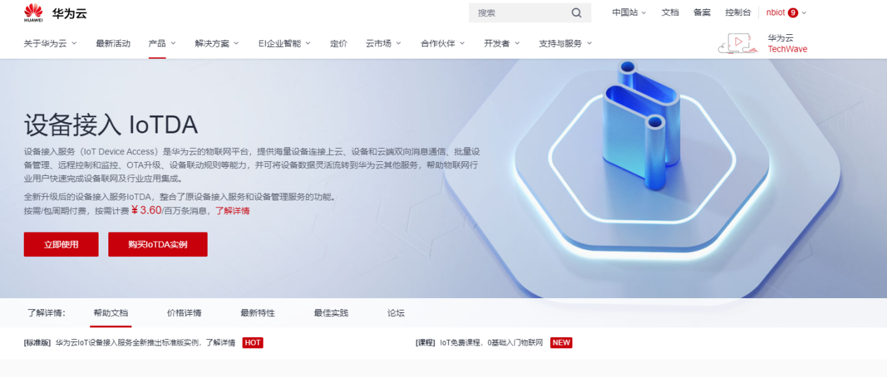
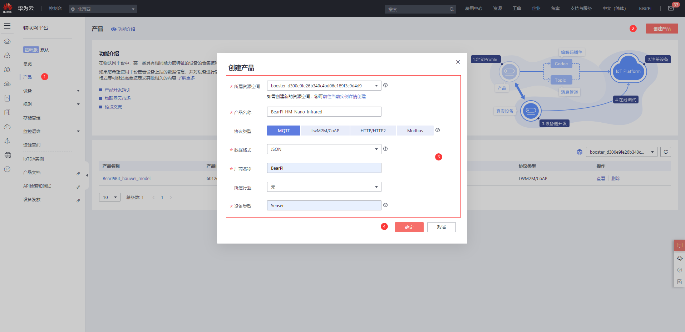
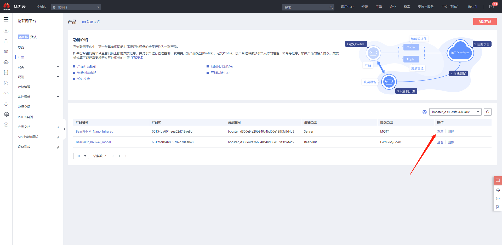
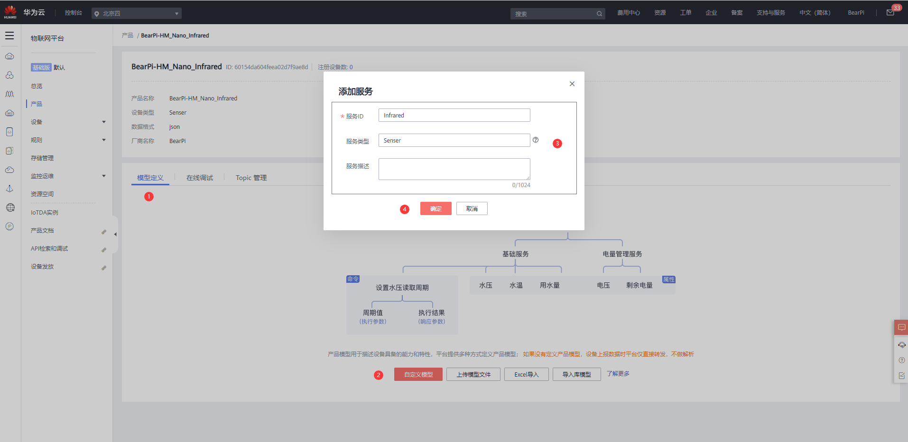
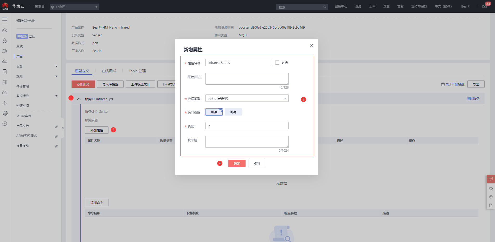
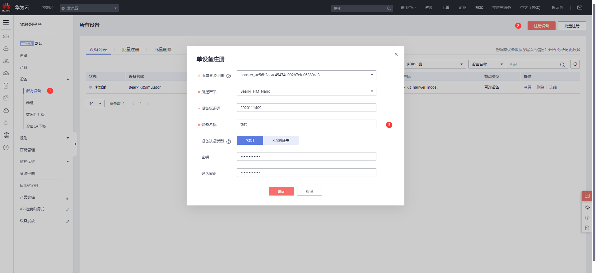
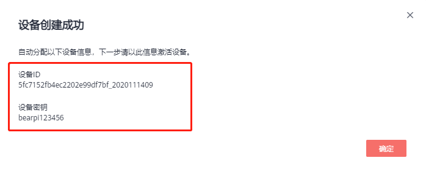
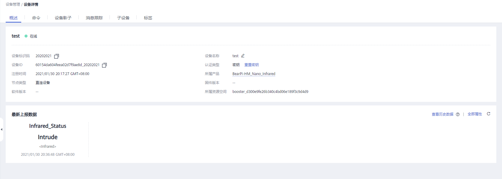

# BearPi-HM_Nano开发板智慧安防案例开发
本示例将演示如何在BearPi-HM_Nano开发板上使用MQTT协议连接华为IoT平台，使用E53_IS1 智慧安防扩展板与 BearPi-HM_Nano 开发板实现智慧安防的案例，设备安装如下图所示。


## 软件设计

### 连接平台
在连接平台前需要设置获取CONFIG_APP_DEVICEID、CONFIG_APP_DEVICEPWD、CONFIG_APP_SERVERIP、CONFIG_APP_SERVERPORT，通过oc_mqtt_profile_connect()函数连接平台。
```c
    WifiConnect(CONFIG_WIFI_SSID, CONFIG_WIFI_PWD);
    dtls_al_init();
    mqtt_al_init();
    oc_mqtt_init();
    
    g_app_cb.app_msg = queue_create("queue_rcvmsg",10,1);
    if(NULL ==  g_app_cb.app_msg){
        printf("Create receive msg queue failed");
        
    }
    oc_mqtt_profile_connect_t  connect_para;
    (void) memset( &connect_para, 0, sizeof(connect_para));

    connect_para.boostrap =      0;
    connect_para.device_id =     CONFIG_APP_DEVICEID;
    connect_para.device_passwd = CONFIG_APP_DEVICEPWD;
    connect_para.server_addr =   CONFIG_APP_SERVERIP;
    connect_para.server_port =   CONFIG_APP_SERVERPORT;
    connect_para.life_time =     CONFIG_APP_LIFETIME;
    connect_para.rcvfunc =       msg_rcv_callback;
    connect_para.security.type = EN_DTLS_AL_SECURITY_TYPE_NONE;
    //连接平台
    ret = oc_mqtt_profile_connect(&connect_para);
    if((ret == (int)en_oc_mqtt_err_ok)){
        g_app_cb.connected = 1;
        printf("oc_mqtt_profile_connect succed!\r\n");
    }
    else
    {
        printf("oc_mqtt_profile_connect faild!\r\n");
    }
```

### 推送数据

当需要上传数据时，需要先拼装数据，让后通过oc_mqtt_profile_propertyreport上报数据。代码示例如下： 

```c
static void deal_report_msg(void)
{
    oc_mqtt_profile_service_t service;
    oc_mqtt_profile_kv_t status;

    if (g_app_cb.connected != 1) {
        return;
    }
    service.event_time = NULL;
    service.service_id = "Infrared";
    service.service_property = &status;
    service.nxt = NULL;
    
    status.key = "Infrared_Status";
    status.value = g_infraredStatus ? "Intrude" : "Safe";
    status.type = EN_OC_MQTT_PROFILE_VALUE_STRING;
    status.nxt = NULL;
    //发送数据
    oc_mqtt_profile_propertyreport(NULL,&service);
    return;
}
```


## 编译调试


### 登录

设备接入华为云平台之前，需要在平台注册用户账号，华为云地址：<https://www.huaweicloud.com/>

在华为云首页单击产品，找到IoT物联网，单击设备接入IoTDA 并单击立即使用，如下图所示。




### 创建产品

在设备接入页面可看到总览界面，展示了华为云平台接入的协议与域名信息，根据需要选取MQTT通讯必要的信息备用，如下图所示。

接入协议（端口号）：MQTT 1883

域名：iot-mqtts.cn-north-4.myhuaweicloud.com


选中侧边栏产品页，单击右上角“创建产品”，在页面中选中所属资源空间，并且按要求填写产品名称，选中MQTT协议，数据格式为JSON，并填写厂商名称，在下方模型定义栏中选择所属行业以及添加设备类型，并单击右下角“确定”，如下图所示。



创建完成后，在产品页会自动生成刚刚创建的产品，单击“查看”可查看创建的具体信息，如下图所示。




单击产品详情页的自定义模型，在弹出页面中新增服务，如下图所示。

服务ID：`Infrared`(必须一致)

服务类型：`Senser`(可自定义)


在“Infrared”的下拉菜单下点击“添加属性”填写“Infrared_Status”相关信息，如下图所示。





#### 注册设备

在侧边栏中单击“设备”，进入设备页面，单击右上角“注册设备”，勾选对应所属资源空间并选中刚刚创建的产品，注意设备认证类型选择“秘钥”，按要求填写秘钥，如下图所示。



记录下设备ID和设备密钥，如下图所示。


注册完成后，在设备页面单击“所有设备”，即可看到新建的设备，同时设备处于未激活状态，如下图所示。


### 修改代码中设备信息
修改`iot_cloud_oc_sample.c`中第31行附近的wifi的ssid和pwd，以及设备的DEVICEID和DEVICEPWD（这两个参数是在平台注册设备时产生的），如下图所示。


### 修改 BUILD.gn 文件

修改 `device\bearpi\bearpi_hm_nano\app`路径下 BUILD.gn 文件，指定 `cloud_oc_infrared` 参与编译。

```r
#"D7_iot_cloud_oc_smoke:cloud_oc_smoke",
#"D8_iot_cloud_oc_light:cloud_oc_light",
#"D9_iot_cloud_oc_manhole_cover:cloud_oc_manhole_cover",
"D10_iot_cloud_oc_infrared:cloud_oc_infrared",
#"D11_iot_cloud_oc_agriculture:cloud_oc_agriculture",
#"D12_iot_cloud_oc_gps:cloud_oc_gps",
```
### 测试

示例代码编译烧录代码后，按下开发板的RESET按键，平台上的设备显示为在线状态，如下图所示。


    
点击设备右侧的“查看”，进入设备详情页面，可看到上报的数据，如下图所示。



