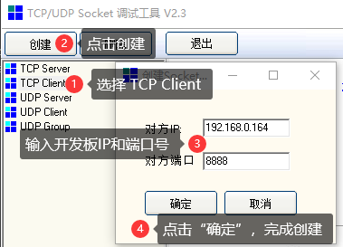
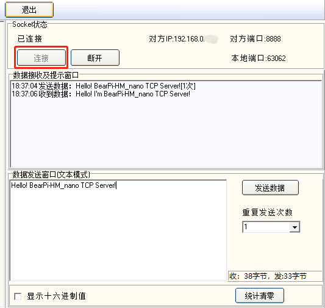

# BearPi-HM_Nano开发板WiFi编程开发——TCP服务器
本示例将演示如何在BearPi-HM_Nano开发板上使用socket编程创建TCP服务端，接收客户端消息并回复固定消息。


## socket API分析
本案例主要使用了以下几个API来完成TCP Server的编程实验。
### socket()

```c
sock_fd = socket(AF_INET, SOCK_STREAM, 0)) //AF_INT:ipv4, SOCK_STREAM:tcp协议
```
**描述：**

在网络编程中需要进行的第一件事情就是创建一个socket，无论是客户端还是服务器端，都需要创建一个socket。该函数返回socket文件描述符，类似于文件描述符。socket是一个结构体，被创建在内核中。
### bind()
```c
bind(sockfd, (struct sockaddr*)&server_sock, sizeof(server_sock))
```
**描述：**

把一个本地协议地址和socket绑定，比如把本机的2222端口绑定到socket。注意：在客户端不需要调用bind函数，这是因为如果没有调用bind函数绑定一个端口的话，当调用connect函数时，内核会为该socket临时分配一个端口。因为所有客户端都需要知道服务器使用的是哪个端口，所以在服务器侧需要提前绑定确定的端口号。


### listen()
```c
int listen(int s, int backlog)
```
**描述：**

当socket创建后，它通常被默认为是主动套接字，即默认要马上调用connect函数的，而作为服务器是需要被动接收的，所以需要调用listen函数将主动套接字转换成被动套接字。调用listen函数后，内核将从该socket接收连接请求。


### accept()
```c
int accept(s, addr, addrlen)    
```
**描述：**

此函数返回已经完成连接的socket。注意：此处的socket不同于服务器开始时创建的监听socket，此socket是已经完成连接的套接字，监听socket只是用来监听。

### recv()
```c
int recv(SOCKET s, char *buf, int len, int flags)
```
**描述：**

recv函数用来从已建立TCP连接的另一端接收数据。

### send()
```c
int send(SOCKET s, char *buf, int len, int flags)
```
**描述：**

send函数用来向已建立TCP连接的另一端发送数据。


## 软件设计

**主要代码分析**

完成TCP server的建立及收发功能实现需要以下几步：

1. 通过 `socket` 接口创建一个socket，`AF_INT`表示ipv4，`SOCK_STREAM`表示使用tcp协议。
2. 调用 `bind` 接口绑定socket和地址。
3. 调用 `listen` 接口监听指定port，通知操作系统去接收来自客户端的连接请求，第二个参数：指定队列长度。
4. 调用`accept`接口从队列中获得一个客户端的连接请求。
5. 调用 `recv` 接口接收客户端发来的数据。
6. 调用 `send` 接口向客户端回复固定的数据。

```c
static void TCPServerTask(void)
{
    //在sock_fd 进行监听，在 new_fd 接收新的链接
    int sock_fd, new_fd;

    //服务端地址信息
    struct sockaddr_in server_sock;

    //客户端地址信息
    struct sockaddr_in client_sock;
    int sin_size;

    struct sockaddr_in *cli_addr;

    //连接Wifi
    WifiConnect(CONFIG_WIFI_SSID, CONFIG_WIFI_PWD);

    //创建socket
    if ((sock_fd = socket(AF_INET, SOCK_STREAM, 0)) == -1) {
        perror("socket is error\r\n");
        exit(1);
    }

    bzero(&server_sock, sizeof(server_sock));
    server_sock.sin_family = AF_INET;
    server_sock.sin_addr.s_addr = htonl(INADDR_ANY);
    server_sock.sin_port = htons(CONFIG_CLIENT_PORT);

    //调用bind函数绑定socket和地址
    if (bind(sock_fd, (struct sockaddr *)&server_sock, sizeof(struct sockaddr)) == -1) {
        exit(1);
    }

    //调用listen函数监听(指定port监听)
    if (listen(sock_fd, TCP_BACKLOG) == -1) {
        exit(1);
    }

    printf("start accept\n");

    //调用accept函数从队列中
    while (1) {
        sin_size = sizeof(struct sockaddr_in);

        if ((new_fd = accept(sock_fd, (struct sockaddr *)&client_sock, (socklen_t *)&sin_size)) == -1) {
            perror("accept");
            continue;
        }

        cli_addr = malloc(sizeof(struct sockaddr));

        printf("accept addr\r\n");

        if (cli_addr != NULL) {
            int ret = memcpy_s(cli_addr, sizeof(cli_addr), &client_sock, sizeof(struct sockaddr));
            if (!ret) {
                perror("memcpy is error\r\n");
                exit(1);
            }
        }
        //处理目标
        ssize_t ret;

        while (1) {
            memset_s(recvbuf, sizeof(recvbuf), 0, sizeof(recvbuf));
            if ((ret = recv(new_fd, recvbuf, sizeof(recvbuf), 0)) == -1) {
                printf("recv error \r\n");
            }
            printf("recv :%s\r\n", recvbuf);
            sleep(TASK_DELAY_2S);
            if ((ret = send(new_fd, buf, strlen(buf) + 1, 0)) == -1) {
                perror("send : ");
            }
            sleep(TASK_DELAY_2S);
        }
        close(new_fd);
    }
}
```

## 编译调试

### 修改 BUILD.gn 文件

修改 `device\board\bearpi\bearpi_hm_nano\app` 路径下 BUILD.gn 文件，指定 `tcp_server` 参与编译。
```r
#"D1_iot_wifi_sta:wifi_sta",
#"D2_iot_wifi_sta_connect:wifi_sta_connect",      
#"D3_iot_udp_client:udp_client",
"D4_iot_tcp_server:tcp_server",
#"D5_iot_mqtt:iot_mqtt",        
#"D6_iot_cloud_oc:oc_mqtt",
```   


### 运行结果

示例代码编译烧录后，按下开发板的RESET按键，通过串口助手查看日志，会打印模块的本地IP，如本例程中的 `192.168.0.164` ,并开始准备获取客户端的请求链接。
```
g_connected: 1
netifapi_dhcp_start: 0
server :
        server_id : 192.168.0.1
        mask : 255.255.255.0, 1
        gw : 192.168.0.1
        T0 : 7200
        T1 : 3600
        T2 : 6300
clients <1> :
        mac_idx mac             addr            state   lease   tries   rto     
        0       181131a48f7a    192.168.0.164   10      0       1       2       
netifapi_netif_common: 0
start accept
```
使用 Socket tool 创建客户端用于测试，如下图所示。



在创建客户端后点击“连接”，在数据发送窗口输入要发送的数据，点击发送后服务端会回复固定消息，如下图所示，且开发板收到消息后会通过日志打印出来。

```
start accept
accept addr
recv :Hello! BearPi-HM_nano TCP Server!
```

