# BearPi-HM_Nano开发板WiFi编程开发——MQTT协议开发
本示例将演示如何在BearPi-HM_Nano开发板上使用MQTT协议进行通信。


## 编译调试

 **注意：如果在windows上收不到mqtt消息，具体表现为在设备串口观察到串口信息卡在"NetworkConnect  ..."，超时时间过后，一直打印"Return code from MQTT publish is -1"。遇到此问题，请关闭windows防火墙后再做验证。**

### 下载MQTT消息代理工具Mosquitto

> **注：** 使用windows10/11 搭建mqtt 服务端和协助验证的客户端

点击[下载](https://mosquitto.org/download/)Mosquitto 工具作为MQTT 服务端，如下图所示。

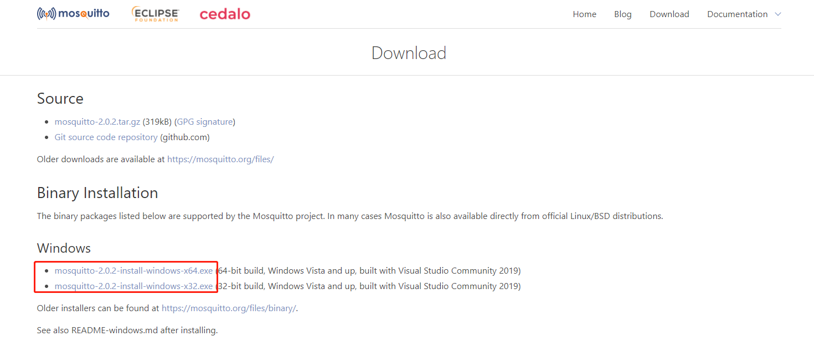

下载后双击安装包，安装工具，安装完毕后，打开计算机管理，在“服务”中开启mosquitto服务，如下图所示。
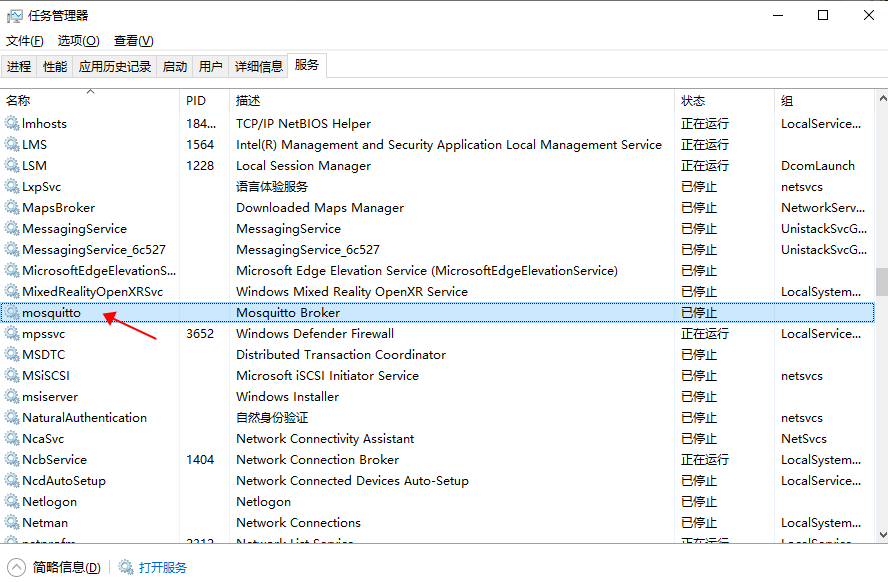

修改安装路径下的mosquitto.conf文件，修改515行附近代码，如下图所示。
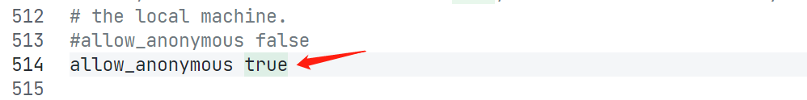

修改216行附近代码，如下图所示，其中`192.168.0.173`为自己的电脑的IP地址（即mqtt server的IP地址）。
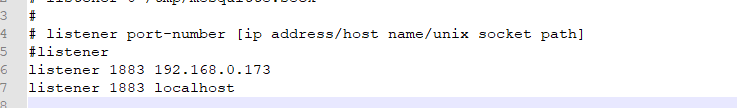

修改配置后，保存，然后在“服务”中重新启动mosquitto服务。

### 下载Eclipse Paho MQTT 工具
点击[下载](https://repo.eclipse.org/content/repositories/paho-releases/org/eclipse/paho/org.eclipse.paho.ui.app/1.1.1/)Eclipse Paho MQTT 工具作为MQTT的客户端，如下图所示。


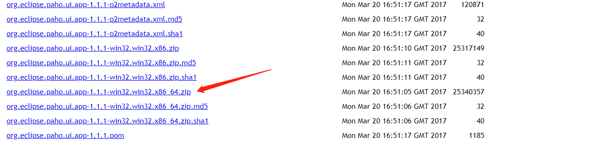

解压缩后，双击paho.exe，打开后的Eclipse Paho UI开始界面，点击上图中的 十字图标，就能新建一个MQTT的客户端的连接，如下图所示。

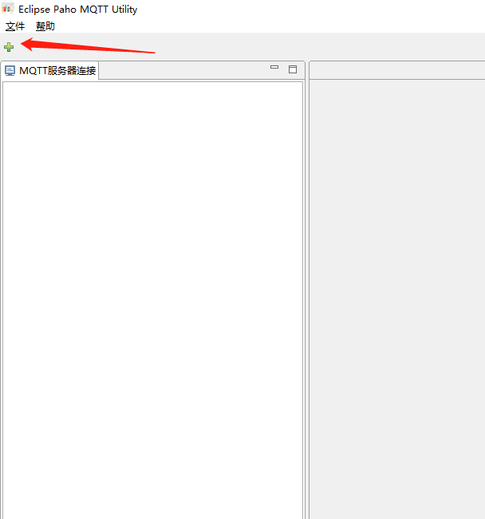

输入正确的MQTT服务端的连接地址，比如，本例中的连接地址是tcp://localhost:1883,然后点击“连接”按钮，这个时候，如果MQTT服务端没有设置密码（默认情况是没有密码的）的话，这个时候就能看到连接得到状态是“已连接”，如下图所示。
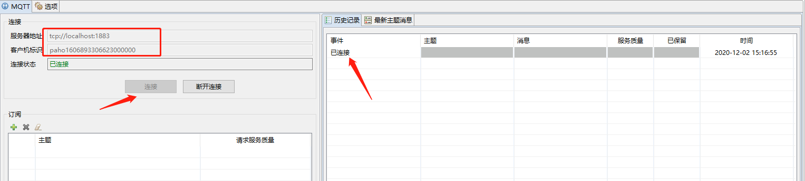


这个时候就能订阅消息了。选择“订阅”下方的绿色十字图标，就可以输入订阅的主题（topic）的名字，比如设置主题名称为“pubtopic”，并点击 “订阅”按钮，如下图所示。
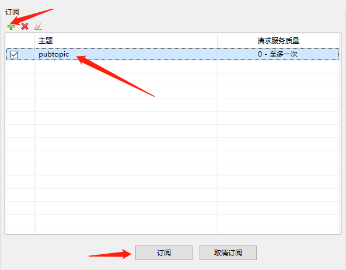

> **注:** 也可以使用客户端工具 MQTT Explorer进行验证

### 修改对接IP
将代码中对接的IP修改为电脑在命令行窗口里输入 `ipconfig` 查询的电脑的本地IP，如下图所示。

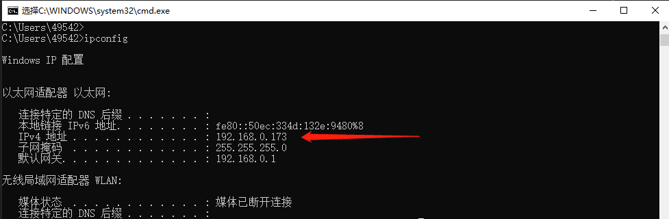

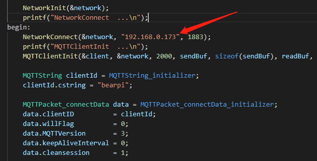


### 修改 BUILD.gn 文件

修改 `device\board\bearpi\bearpi_hm_nano\app`路径下 BUILD.gn 文件，指定 `iot_mqtt` 参与编译。

```r
#"D1_iot_wifi_sta:wifi_sta",
#"D2_iot_wifi_sta_connect:wifi_sta_connect",       
#"D3_iot_udp_client:udp_client",
#"D4_iot_tcp_server:tcp_server",
"D5_iot_mqtt:iot_mqtt",        
#"D6_iot_cloud_oc:oc_mqtt",
```

示例代码编译烧录后，按下开发板的RESET按键，Eclipse Paho MQTT 工具上会接收到开发板发布的MQTT消息，如下图所示。

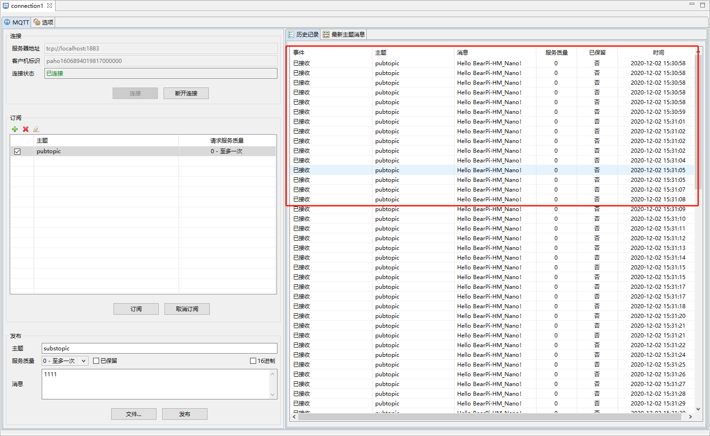


往开发板发送一条消息主题为“substopic”，内容为“Hello”的MQTT消息。然后点击“发布”按钮，这个时候就能看到消息已经发送成功，如下图所示。

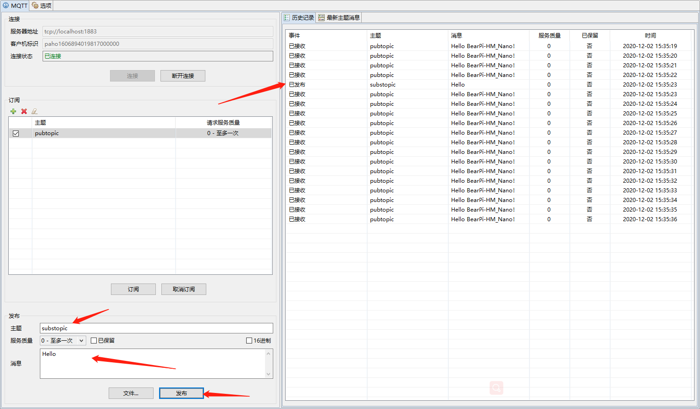

且开发板的串口上也打印出接收消息成功的信息，如下图所示。

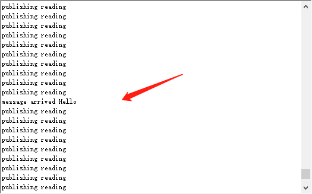

