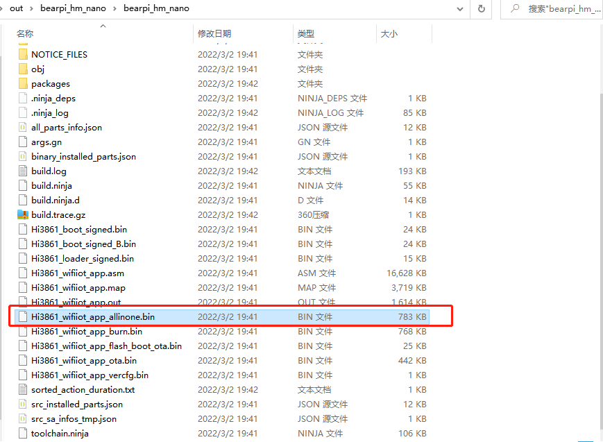
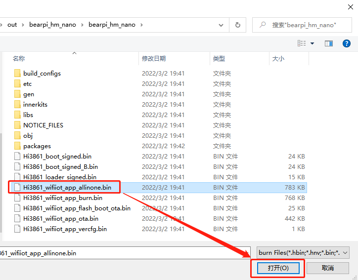
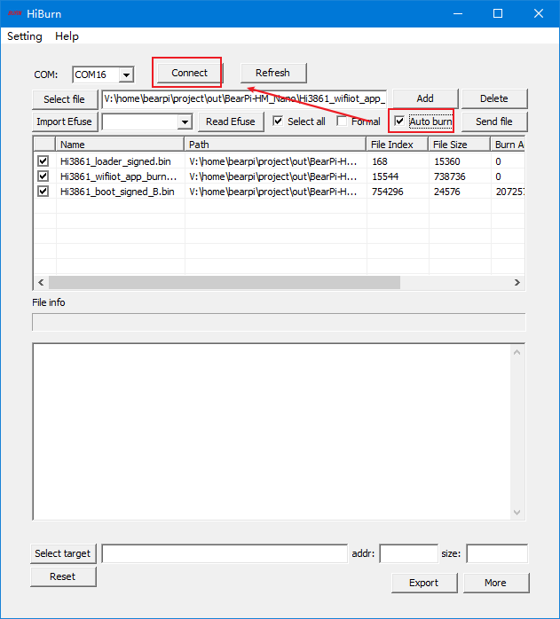
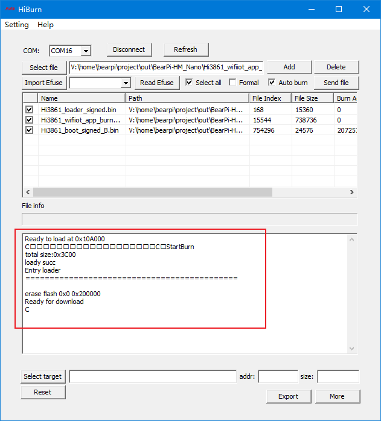

# BearPi-HM_Nano开发板编译调试
## 获取源码
```
repo init -u git@gitee.com:openharmony/manifest.git -b master --no-repo-verify
repo sync -c
repo forall -c 'git lfs pull'
```
## 源码编译

1. 在源码目录下输入以下指令。
    ```
    hb set

    bearpi
        >bearpi_hm_nano

    选择bearpi_hm_nano

    hb build -f
    ```

2. 查看编译出的固件位置

    当编译完后，在Windows中可以直接查看到最终编译的固件，具体路径在：
    `\out\bearpi_hm_nano\bearpi_hm_nano`

    
    

## 烧录程序
### 一、连接开发板
1. 通过TypeC数据线，把电脑与BearPi-HM Nano连接。

2. 安装CH340驱动。

3. 关闭虚拟机捕获USB功能。（有很多开发者都是因为虚拟机捕获了USB设备，导致本机Windows电脑看不到串口），如下图所示。

    

    如果上面操作不行，直接关闭VMware Workstation，选择挂起，然后再重新插拔USB。

4. 查看开发板的串口，如下图所示。

    

### 二、烧录代码
1. 在Windows打开Hiburn工具，并点击`Refresh`，在`COM`中选择`第一-4`看到的COM号，如下图所示。
- Hiburn工具下载地址（百度云）：https://pan.baidu.com/s/1vSpPWvIhL8wCVGnEOjXS7g?pwd=1234 提取码：1234


    

    然后点击`Setting`，并选择 `Com settings`。

2. 在Com settings中设置`Baud`为：`921600`，点击确定 ，如下图所示。   

    

3. 点击 Hiburn工具中的`Select file`按钮，在弹出的文件框中，选择工程文件`./out/bearpi_hm_nano/bearpi_hm_nano/` 路径下的`Hi3861_wifiiot_app_allinone.bin` 文件，如下图所示。

    

4. 点击`Auto burn`复选框，然后点击`Connect`，如下图所示。

    

    此时`Connect`按钮变成`Disconnect`，等待下载。

5. 复位开发板`RESET`按键，开始下载程序，如下图所示。

    

    

    
6. 直到出现`Execution Successful`字样，程序下载完成。

7. 下载完后，点击`Disconnect`按钮，便于后面调测使用。
